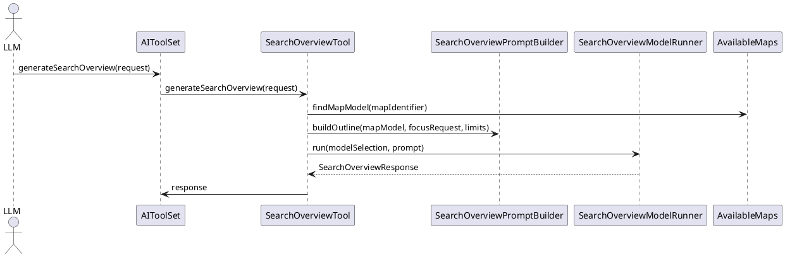

# Task: Add search overview tool
- **Task Identifier:** 2026-01-27-search-overview
- **Scope:** Add a `generateSearchOverview` tool that returns a compact map overview and index for targeted search, with optional model selection and size limits.
- **Motivation:** Large maps need a low cost overview and index to guide targeted reads and searches without flooding the primary chat model.
- **Briefing:** The search overview request/response DTOs already exist, but no tool implementation or tool registration is present in the `AIToolSet`. The design adds a `SearchOverviewTool` that builds a compact map outline, invokes a configurable model (defaulting to the current chat model selection), and validates/trims the response to the requested section/keyword limits before returning it. Tests cover map lookup, model selection, limit enforcement, and response validation.
- **Research:**
  - `SearchOverviewRequest`, `SearchOverviewResponse`, `SearchOverviewSection`, and `SearchOverviewKeyword` already exist as JSON DTOs under `org.freeplane.plugin.ai.tools.search`, but there is no tool class that produces them.
  - `AIToolSet` exposes tools via `@Tool`-annotated methods; no overview tool is registered today.
  - `SearchNodesTool` resolves map identifiers via `AvailableMaps`, traverses nodes using an explicit stack, and reads brief node text via `NodeContentItemReader` with `NodeContentPreset.BRIEF`.
  - Model selection in chat is stored as a selection value of the form `provider|model` (`AIModelSelection`), and `AIChatModelFactory` builds provider-specific `ChatModel` instances based on that selection.
  - The `freeplane-user-interface-search-analysis.md` spec proposes a `generateSearchOverview` tool with the same input/output schema and an optional `modelIdentifier` for cheaper model selection.
- **Design:**
  - Implement `SearchOverviewTool` in `org.freeplane.plugin.ai.tools.search` with a `generateSearchOverview(SearchOverviewRequest request)` method.
  - Resolve and validate `mapIdentifier` via `AvailableMaps`, mirroring `SearchNodesTool` error behavior for missing or invalid IDs.
  - Build an outline payload using `NodeContentItemReader` and `NodeContentPreset.BRIEF`:
    - Traverse the map from the root in a deterministic order (preorder with an explicit stack).
    - Collect a bounded outline list of nodes with identifier, brief text, and depth.
    - Enforce an internal outline size cap (fixed default or configurable constant) to keep the prompt bounded.
  - Model selection:
    - Accept `modelIdentifier` in the same `provider|model` format used by chat selection; if omitted, reuse the currently selected chat model from `AIProviderConfiguration`.
    - Add an overview-specific model runner that uses `AIChatModelFactory` to create a `ChatModel` for the chosen selection.
  - Prompt and parsing:
    - Build a prompt that includes the outline, the optional `focusRequest`, and the requested `maximumKeywordCount`/`maximumSectionCount`, and instructs the model to return JSON matching `SearchOverviewResponse`.
    - Parse the model response with `ObjectMapper` into `SearchOverviewResponse`; reject invalid JSON or missing required fields with an `IllegalArgumentException`.
  - Limit enforcement:
    - If the response includes more sections or keywords than requested, omit the extras entirely.
    - Within each section, if keyword counts exceed the allowed maximum, omit the extra keywords rather than truncating strings.
  - Tool call summaries:
    - Emit a `ToolCallSummary` with map identifier, section count, keyword count, and whether any omissions were applied.
  - Wire the tool into `AIToolSet` with a new `@Tool("Generate a compact map overview and keyword index for targeted search.")` method.

- **Test specification:**
  - Verify missing/invalid `mapIdentifier` rejects the request with a clear error.
  - Verify `modelIdentifier` overrides the default model selection and is validated as `provider|model`.
  - Verify overview responses are trimmed to `maximumSectionCount`/`maximumKeywordCount` by omitting extras.
  - Verify each section includes `nodeIdentifier`, `nodeText`, and a small keyword list.
  - Verify invalid or non-JSON model output is rejected with a validation error.
