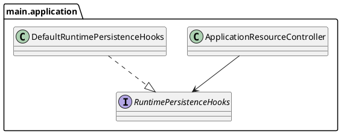

# Task: Redesign ApplicationResourceController for testability
- **Task Identifier:** 2026-02-14-application-resource-controller-testability
- **Scope:** Propose and implement a design that removes direct
  singleton/global lookups from `ApplicationResourceController`
  persistence flow so secrets-persistence behavior can be covered by
  focused automated tests without runtime-global bootstrapping.
- **Motivation:** Current persistence path depends on global runtime
  state (`Controller`, mode/filter controllers), which makes isolated
  tests brittle and drives test-only production patches. We need a clean
  design first, then tests.
- **Briefing:** Keep behavior unchanged for end users.
  Prioritize dependency seams and explicit collaborators over static
  singleton access in save/load paths.
- **Research:**
  - `ApplicationResourceController.saveProperties()` reaches global
    controllers directly.
  - Isolated tests for persistence logic fail without global
    application-mode bootstrap.
  - Recent secrets persistence work needs stable regression coverage.
- **Design:**

Introduce a small dependency seam (for runtime-specific side effects
such as icon/filter saves) and inject a default implementation in
production. Keep pure properties split/merge logic testable without
global bootstrapping.
- **Test specification:**
  - Unit tests for persistence split/merge behavior with fake
    `RuntimePersistenceHooks`.
  - Unit test for secrets overlay precedence on load.
  - Unit test for legacy migration from `auto.properties` to
    `secrets.properties`.
  - Integration-level test (optional) for default hooks wiring in
    application mode.
