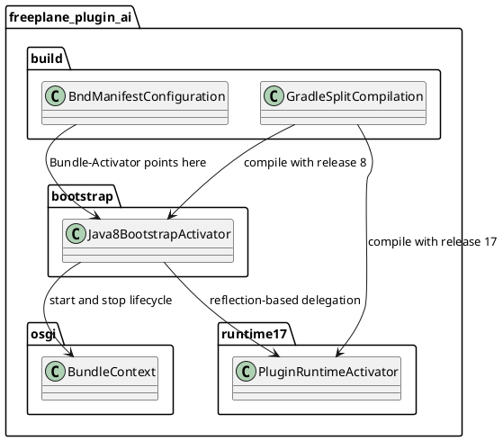

# Task: Add Java 8 bootstrap activator for AI plugin startup gating
- **Task Identifier:** 2026-02-14-bootstrap-activator
- **Scope:** Make `freeplane_plugin_ai` start on any Java runtime where the
  bundle can load, including Java 8, while keeping the main plugin logic
  on Java 17. The OSGi entry point must be a Java 8 compatible bootstrap
  activator that enables the full plugin only when runtime Java is at
  least 17. On Java 8–16 it must still create the AI tab, but render
  only an informational view that AI functionality requires Java 17+.
- **Motivation:** The plugin should fail gracefully on older runtimes
  instead of failing to resolve or crashing during class loading, while
  preserving Java 17 usage for the main implementation and dependencies.
- **Briefing:** Keep the current main activator behavior for
  Java 17+ and introduce a separate bootstrap activator compiled for Java
  8. The bootstrap activator becomes the manifest `Bundle-Activator`,
  checks runtime Java version, and reflectively starts the Java 17 main
  activator only when supported. Build configuration must compile
  bootstrap and main sources separately with different release targets
  and must prevent OSGi execution-environment metadata from forcing Java
  17 at bundle resolution time. No code changes should start before this
  design is approved.
- **Research:**
  - `freeplane_plugin_ai/build.gradle` currently compiles plugin code with
    `sourceCompatibility` and `targetCompatibility` set to Java 21.
  - The plugin does not maintain a source `META-INF/MANIFEST.MF`; OSGi
    manifest entries are generated by Bnd from root build logic in
    `freeplane/build.gradle`.
  - Generated manifest
    `freeplane_plugin_ai/build/manifest/MANIFEST.MF` currently contains
    `Require-Capability` for `osgi.ee=JavaSE` version `21`, preventing
    startup on older JVMs before activator code can run.
  - Existing `org.freeplane.plugin.ai.Activator` references many plugin
    classes directly and is not suitable as a Java 8-compatible entry
    point when main code remains Java 17.
  - Verified plugin dependency artifacts in local Gradle cache for
    `langchain4j` and related libraries are compiled to Java 17 bytecode
    (`major version 61`), so main runtime minimum remains Java 17.
- **Design:**

Introduce a new `Java8BootstrapActivator` in a dedicated source set
compiled with `--release 8`. It must only use Java 8 language and APIs.

Move existing activator behavior into `PluginRuntimeActivator` (or keep
the current class as runtime activator) compiled with `--release 17`.

Bootstrap `start(BundleContext)` flow:
- parse runtime Java major version using Java 8-compatible logic;
- if runtime major `< 17`, create/register an AI tab placeholder with an
  informational message stating that AI functionality requires Java 17+
  and do not initialize runtime AI plugin components;
- if runtime major `>= 17`, load runtime activator class by name via
  reflection, instantiate it, and call `start(BundleContext)`;
- retain runtime activator instance for delegated `stop(BundleContext)`.

Bootstrap `stop(BundleContext)` flow:
- if runtime activator was started successfully, invoke delegated stop;
- otherwise no-op.

Gradle changes in plugin module:
- split sources into Java 8 bootstrap source set and Java 17 main source
  set;
- compile bootstrap and main classes with separate `JavaCompile` tasks;
- ensure resulting plugin jar contains both sets of compiled classes.

Target source folder structure in `freeplane_plugin_ai`:
- `src/bootstrap/java/...` for Java 8 bootstrap-only classes, including
  `Java8BootstrapActivator`;
- `src/main/java/...` for Java 17 runtime plugin code, including runtime
  activator and existing AI functionality;
- `src/test/java/...` for automated tests covering bootstrap/runtime
  delegation and compatibility behavior.

Bnd manifest changes:
- set `Bundle-Activator` to bootstrap activator class;
- configure Bnd so bundle metadata does not enforce Java 17 execution
  environment at resolve time, allowing bundle load on Java 8 and
  runtime gating inside bootstrap code.

Compatibility behavior:
- on Java 8 to Java 16, plugin remains installed, creates AI tab, and
  shows informational Java 17+ requirement text without enabling AI
  functionality;
- on Java 17+, behavior matches current plugin startup path.
- **Test specification:**
  - Automated tests:
    - Add bootstrap activator tests verifying:
      - runtime `< 17` does not instantiate runtime activator;
      - runtime `< 17` creates AI tab placeholder with Java 17+
        requirement message;
      - runtime `>= 17` instantiates and delegates start and stop;
      - runtime activator reflection failure is handled without crashing
        host startup.
    - Add manifest assertion test or build verification task confirming:
      - `Bundle-Activator` equals bootstrap class;
      - final manifest does not force Java 17 execution environment.
    - Add bytecode level check in build or test verifying:
      - bootstrap activator class target is Java 8;
      - runtime activator class target is Java 17.
  - Manual tests:
    - Start Freeplane with Java 8 and verify:
      - application starts successfully;
      - AI tab is visible;
      - AI plugin does not initialize functional UI/tools;
      - AI tab shows user-visible Java 17+ requirement message.
    - Start Freeplane with Java 17 and verify:
      - AI tab and MCP features initialize normally;
      - no regressions in existing plugin startup behavior.
