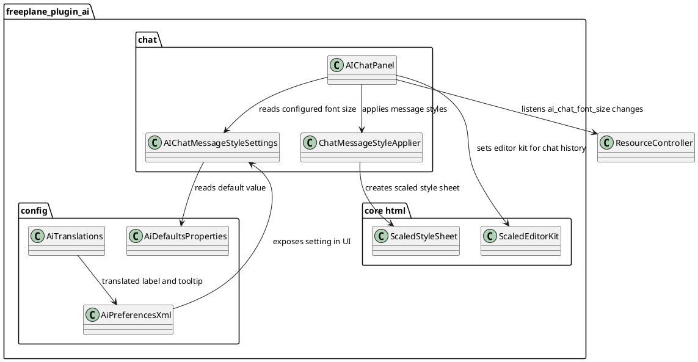

# Task: Configure AI panel message font size with scaled HTML styling
- **Task Identifier:** 2026-02-14-ai-panel-font-size
- **Scope:** Update AI panel message rendering to use scaled HTML style
  handling and add a configurable main chat message font size in AI
  plugin settings, including live style refresh when the setting value
  changes while the panel is open.
- **Motivation:** AI panel message text should follow Freeplane display
  scaling behavior and allow users to adjust readability through
  preferences instead of hardcoded values.
- **Briefing:** Replace plain HTML stylesheet usage in AI chat
  message rendering with scaled stylesheet support and wire the main
  message font size to a plugin preference with defaults and translation
  keys. Apply updated font size immediately while the AI panel is open.
  Keep changes minimal and focused on AI panel rendering.
- **Research:**
  - `ChatMessageStyleApplier` currently creates a plain `StyleSheet` and
    hardcodes `body` font size `12pt`.
  - Core provides `org.freeplane.core.ui.components.html.ScaledStyleSheet`
    and `ScaledEditorKit` for display-scale-aware HTML rendering.
  - AI plugin preferences are defined through
    `freeplane_plugin_ai/src/main/resources/org/freeplane/plugin/ai/preferences.xml`
    and defaults in `defaults.properties`, with labels in
    `freeplane/src/viewer/resources/translations/Resources_en.properties`.
- **Design:**

Introduce `AIChatMessageStyleSettings` to read a new AI preference
property for chat message font size (main body size).

Update AI panel setup to use `ScaledEditorKit` for message history and
pass configured font size to `ChatMessageStyleApplier`.
Register an AI panel property listener for the font-size setting and
re-apply styles + rebuild message history when the value changes,
without reopening the panel.

Update `ChatMessageStyleApplier` to build styles on top of
`ScaledStyleSheet`, applying configured main font size to message body.
Derive the secondary small text size automatically as `5/6` of the main
size (no separate user preference). For message block spacing, compute
`pt` values from the configured main font size (instead of `em`) so
Swing CSS parsing reliably applies margins and paddings. Keep reduced
distance, use symmetric internal spacing (`padding-top == padding-bottom`),
and apply external spacing on one side only for message containers.

Add new preference entries:
- property key in `defaults.properties`, default `10`;
- `<number ...>` item in `preferences.xml` with reasonable bounds;
- translation keys in `Resources_en.properties` for label and tooltip.
Do not add a second preference for small/context text size.
- **Test specification:**
  - Automated tests:
    - Add/adjust AI chat style tests verifying scaled stylesheet usage
      and configured body font size application.
    - Message-spacing property checks are waived by explicit user
      request for this change.
    - Verify build/tests pass with property-change listener wiring for
      live style refresh.
    - Run targeted AI plugin tests for chat style and AI panel refresh
      paths affected by editor kit/style changes.
  - Manual tests:
    - Open AI panel on standard scale and confirm message rendering is
      unchanged at default font setting.
    - Change font-size setting in preferences and confirm AI panel
      message text size updates in the currently open panel.
