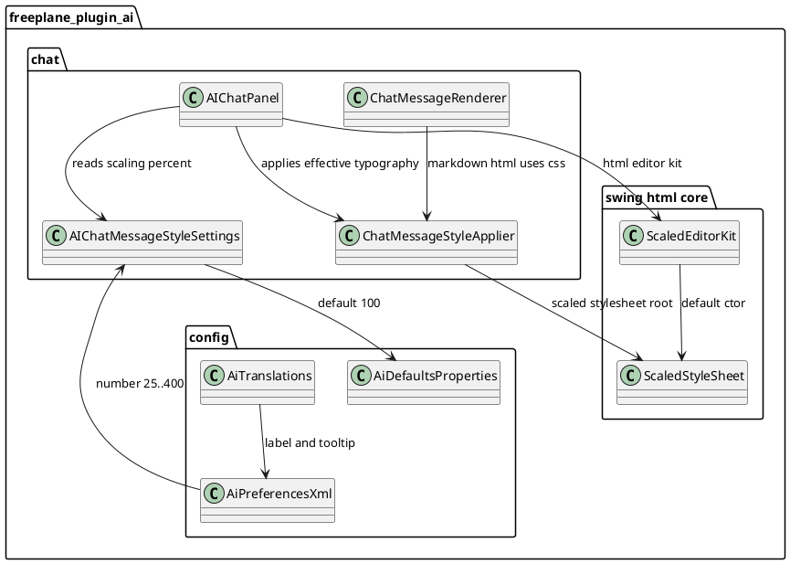

# Task: Replace AI chat font size with scaling based on UI base font
- **Task Identifier:** 2026-02-14-ai-chat-font-scaling
- **Scope:** Replace AI chat message font-size preference with a new
  percentage-based scaling preference and make markdown-derived HTML
  typography scale from the UI base font across body text, headings,
  code/preformatted text, and message spacing, with scaling applied
  through the stylesheet chain that actually styles markdown tags in
  Swing.
- **Motivation:** Point-based direct size setting does not behave
  consistently once markdown is rendered to HTML in Swing because tag
  styles come from default Swing/SHTML rules unless explicitly
  overridden. A scaling model integrated into the stylesheet mechanism
  is more natural for users and keeps proportional typography from one
  base source.
- **Briefing:** Remove usage of `ai_chat_font_size` in AI chat
  styling and introduce `ai_chat_font_scaling` (`25..400`, default
  `100`). Parameterize `ScaledStyleSheet` with explicit scale factor and
  use it in AI chat so markdown typography is scaled by stylesheet
  mechanics instead of per-tag manual sizing.
- **Research:**
  - AI chat messages are rendered as markdown HTML via
    `ChatMessageRenderer` and inserted into `JEditorPane` through
    `ChatMessageHistory`.
  - `ChatMessageRenderer` uses `Marked.marked(...)` and returns HTML
    markup fragments; it does not provide stylesheet rules for markdown.
  - Effective CSS for markdown currently comes from the Swing HTML
    stylesheet chain:
    - `ScaledEditorKit.getStyleSheet()` base rules
      (`ScaledHTML.styleChanges` for `p/body` margins) plus inherited
      default Swing/SHTML HTML rules;
    - AI chat `ChatMessageStyleApplier` creates a new
      `ScaledStyleSheet`, attaches editor-kit base stylesheet as parent,
      then adds chat-specific class rules (`.message-*`, body).
  - As a result, markdown tags (`h1..h6`, `pre`, `code`, `ul/li`) are
    primarily styled by default Swing HTML rules unless explicitly
    overridden in chat styles.
  - AI chat styling is centralized in `ChatMessageStyleApplier`, which
    already uses `ScaledStyleSheet` and applies message class styles.
  - `ScaledStyleSheet` scales fonts for Swing HTML rendering but does
    not define markdown tag typography by itself.
  - Existing preference `ai_chat_font_size` is a point-based value and
    is not sufficient as a single source once markdown tags with
    defaults (`h1..h6`, `pre`, `code`, lists) participate in rendering.
- **Design:**

Introduce `ai_chat_font_scaling` as the only active AI chat text size
control. Remove usage of `ai_chat_font_size` from AI chat style
settings and style application path.

Extend `ScaledStyleSheet` with constructor-based scale injection:
- `ScaledStyleSheet(float fontScaleFactor)` stores provided scale factor;
- `ScaledStyleSheet()` delegates to parameterized constructor with
  default `UITools.FONT_SCALE_FACTOR`;
- existing behavior for no-arg construction stays unchanged by
  delegation.

In AI chat style application, create stylesheet instance with combined
scale factor:
`effectiveScale = UITools.FONT_SCALE_FACTOR * scalingPercent / 100f`.
Use this effective scale via `ScaledStyleSheet(effectiveScale)` so
markdown html elements (`body`, headings, lists, code/pre) are scaled
consistently by the stylesheet engine.

Keep spacing rules:
- symmetric internal vertical padding (`padding-top == padding-bottom`);
- external spacing on one side only (`margin-top = 0`, `margin-bottom >
  0`).

Update preferences and translations:
- add `ai_chat_font_scaling` with range `25..400`, default `100`;
- remove `ai_chat_font_size` option from AI preferences UI and defaults;
- add translation keys for the new option label/tooltip.

Keep live updates in open AI panel by listening to
`ai_chat_font_scaling` property changes and reapplying styles with chat
history rebuild.
- **Test specification:**
  - Automated tests:
    - Add tests for `ScaledStyleSheet` constructors: no-arg delegates to
      default scale and parameterized constructor applies provided scale.
    - Update AI chat settings/style tests to validate scaling percent
      parsing and combined effective scale derivation.
    - Verify listener wiring uses `ai_chat_font_scaling` and triggers
      style refresh path.
    - Run targeted AI plugin tests for chat rendering and style
      application.
  - Manual tests:
    - Verify default `100%` visually matches UI base text expectations.
    - Verify `25%` and `400%` produce readable min/max extremes without
      broken layout.
    - Verify changing scaling in preferences updates an already open AI
      panel.
