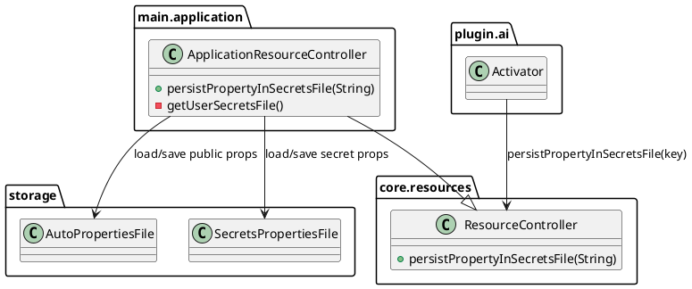

# Task: Store secrets-designated properties in secrets.properties
- **Task Identifier:** 2026-02-14-secured-writing-secrets-properties
- **Scope:** Add controller-level support for properties that must be
  persisted to a separate `secrets.properties` file instead of
  `auto.properties`. Introduce
  `persistPropertyInSecretsFile(...)` in the
  resource-controller API and use it for sensitive AI integration keys.
- **Motivation:** Users often share `auto.properties` for support.
  Sensitive AI keys must not be copied there. Current protection
  (`securePropertyForReadingAndModification`) controls access checks but
  still persists values into `auto.properties`.
- **Briefing:** Do not couple this feature to OptionPanel
  field types (`<secret>`). The persistence split must be implemented in
  `ApplicationResourceController` and API-level security methods.
- **Research:**
  - Before this task, `ApplicationResourceController` read/wrote one
    user-properties file: `auto.properties`
    (`getUserPreferencesFile()` and `saveProperties()`).
  - Existing secure flow (`securedProps` and
    `securePropertyForReadingAndModification(...)`) controlled access,
    but persisted values in `auto.properties`.
  - AI plugin currently secures defaults in `Activator.addPluginDefaults`
    via `securePropertyForReadingAndModification(...)`.
  - OptionPanel `<secret>` currently provides masked UI input only
    (`SecretProperty`), and persistence still goes through generic
    `ResourceController.setProperty(...)`.
  - Therefore separation must happen in controller persistence layer, not
    in OptionPanel control classes.
- **Design:**

API changes:
- add abstract method `persistPropertyInSecretsFile(String key)` to
  `ResourceController`;
- implement it in `ApplicationResourceController` and no-op in
  `AppletResourceController`.

Persistence model in `ApplicationResourceController`:
- add private `getUserSecretsFile()` returning sibling path to
  `auto.properties` named `secrets.properties`;
- keep three in-memory levels:
  - `defProps` (defaults),
  - `props` (auto user properties, defaults=`defProps`),
  - `secretsProps` (secrets user properties, defaults=`props`);
- load sequence on startup:
  - load `auto.properties` into `props`,
  - load `secrets.properties` into `secretsProps`;
- maintain a set of keys marked for `secrets.properties` persistence;
- on save:
  - write `props` to `auto.properties`;
  - write `secretsProps` to `secrets.properties`;
  - do not run merge/split reconciliation logic.

Behavior of `persistPropertyInSecretsFile(key)`:
- mark key for secret-file persistence;
- keep normal runtime access through `getProperty` / `setProperty`;
- if key already exists in `props`, move it immediately to
  `secretsProps` and remove it from `props`;
- do not call, imply, or depend on
  `securePropertyForModification(...)` or
  `securePropertyForReadingAndModification(...)`;
- secure access control and secrets-file persistence are independent
  mechanisms and must be configured separately by callers.

AI integration wiring:
- in AI `Activator`, call `persistPropertyInSecretsFile(...)` for
  sensitive
  keys (at minimum `ai_openrouter_key`, `ai_gemini_key`,
  `ai_mcp_token`);
- keep existing secure-read/modify calls where needed.

Migration behavior:
- migration from `auto.properties` to `secrets.properties` is performed
  when `persistPropertyInSecretsFile(key)` is called for an existing key.
- **Test specification:**
  - Automated tests are explicitly waived for this task due to current
    singleton-heavy architecture in `ApplicationResourceController` save
    path, which creates high coupling to global runtime state in
    isolated tests.
  - Manual tests:
    - Set AI keys in preferences, restart Freeplane, verify values are
      preserved.
    - Inspect user directory: keys are in `secrets.properties` and not
      present in `auto.properties`.
    - Share `auto.properties` content and confirm AI keys are absent.
  - Follow-up:
    - redesign and testability plan moved to backlog task
      `ai-specs/tasks/backlog/redesign-application-resource-controller-testability.md`.
