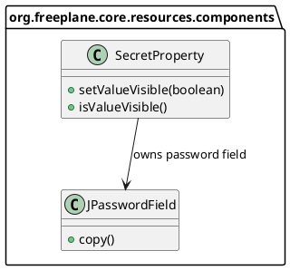
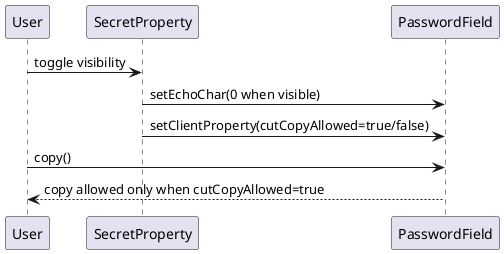

# Task: Allow copying visible secret property values
- **Task Identifier:** 2026-02-15-secret-copy
- **Scope:** Enable clipboard copy for `SecretProperty` values only when
  the field is explicitly visible, while preserving hidden-mode masking
  behavior.
- **Motivation:** Users need to copy secret values for reuse during
  configuration, but only after intentionally revealing the value.
- **Briefing:** Keep default secure behavior unchanged. Do not
  permit copy while value is hidden. Apply minimal UI-component changes
  and add focused tests.
- **Research:**
  - `SecretProperty` currently uses `JPasswordField` with masking enabled by
    default.
  - Visibility toggling is already implemented via
    `setValueVisible(boolean)` and toggle button action.
  - Existing tests verify masking/visibility toggling and value
    roundtripping but do not verify clipboard-copy behavior.
- **Design:**

Implementation outline:
- In `SecretProperty`, set
  `JPasswordField.cutCopyAllowed` client property according to visibility:
  - hidden -> `Boolean.FALSE`
  - visible -> `Boolean.TRUE`
- Rely on `JPasswordField.copy()` behavior that checks this client property.
- Preserve existing toggling, icons, and tooltips.
- **Test specification:**
  - Automated tests:
    - Add tests in
      `freeplane/src/test/java/org/freeplane/core/resources/components/SecretPropertyTest.java`
      verifying `JPasswordField.cutCopyAllowed` transitions with visibility.
    - Keep existing tests for visibility toggle and value roundtrip.
  - Manual tests:
    - In preferences, enter a secret value and verify:
      - copy keyboard/menu does nothing while hidden,
      - after pressing show, copy places the value into clipboard.
