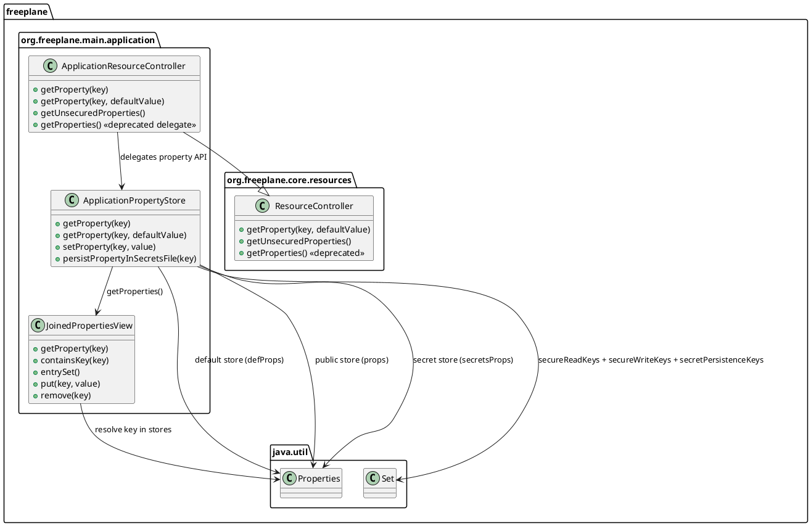
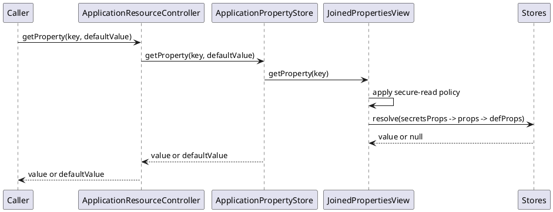

# Task: Fix secret-backed property reads in ApplicationResourceController
- **Task Identifier:** 2026-02-15-secret-property-reads
- **Scope:** Ensure property reads remain correct when keys are persisted in
  `secrets.properties`, specifically for interactions among `defProps`, `props`,
  `secretsProps`, and secure-read/write semantics, while extracting property
  logic from `ApplicationResourceController` into a dedicated testable class.
- **Motivation:** Secret-designated keys can be moved out of `props`, and then
  APIs that read through `getProperties()` may not see them. This causes wrong
  behavior for keys like MCP request `id` and other secret-backed values.
- **Briefing:** Keep storage separation intact (`auto.properties`
  versus `secrets.properties`). Do not expose secured values through broad
  iteration. Keep directory/resource responsibilities in
  `ApplicationResourceController` unchanged.
- **Research:**
  - In this domain, `secret` and `secured` are independent per-key flags:
    - `secret` controls persistence target file only;
    - `secured` controls permission checks for read and/or write.
  - A key may be:
    - neither `secret` nor `secured`,
    - only `secret`,
    - only `secured`,
    - both `secret` and `secured`.
  - Current implementation ties read behavior and persistence policy to
    `ApplicationResourceController`, which mixes concerns:
    - directory/resource handling;
    - property storage and security semantics.
  - Current implementation ties read behavior to concrete backing maps:
    - `getProperty(String key)` resolves through `securedProps`,
    - `getProperties()` exposes only `props`,
    - therefore secret-only keys can disappear for APIs that read through
      `getProperties()`.
  - Repeated copying/merging of property maps is undesirable because it adds
    synchronization and consistency risk for every mutation.
  - Desired direction is:
    - dedicated property component with no singleton dependency;
    - joined read/write policy layer (view/proxy), backed by separate stores,
      with no materialized copy.
- **Design:**

Chosen behavior:
- Extract all property-related behavior from `ApplicationResourceController`
  into `ApplicationPropertyStore`:
  - loading/saving `auto.properties` and `secrets.properties`,
  - store precedence and joined properties view,
  - secret persistence flag and secure read/write flags,
  - `getProperty(...)`, `setProperty(...)`, `persistPropertyInSecretsFile(...)`.
- Keep `ApplicationResourceController` responsibilities unchanged for:
  - directory discovery and creation,
  - resource URL lookup and resource loader handling,
  - application-level wiring and listener delegation.
- Keep physical stores separate:
  - `props` for regular persistence,
  - `secretsProps` for keys marked for secret persistence.
- Introduce `JoinedPropertiesView` in `ApplicationPropertyStore` and return
  it through `ApplicationResourceController.getUnsecuredProperties()`:
  - no full copy; all operations are delegated lazily to backing stores;
  - reads resolve by precedence: `secretsProps`, then `props`, then `defProps`.
- API naming transition:
  - add `getUnsecuredProperties()` as explicit method;
  - keep `getProperties()` as deprecated delegate to
    `getUnsecuredProperties()` without caller migration in this change.
- Enforce independent flags per key:
  - `secretPersistenceKeys` controls write routing to `secretsProps`;
  - `secureReadKeys` controls read access checks;
  - `secureWriteKeys` controls write access checks.
- Iteration (`entrySet`, `propertyNames`, `stringPropertyNames`) returns a
  union view of keys from both stores and applies secure-read policy.
- `getProperty(String, String)` in `ApplicationResourceController` must use the
  same repository path as `getProperty(String)` to preserve one read contract:
  - it calls `getProperty(String)` first;
  - if value is non-null, it returns value;
  - if value is null, it returns provided default;
  - if secure-read check fails, exception is propagated and default is not used.
- **Test specification:**
  - Automated:
    - Add focused unit tests for
      `ApplicationPropertyStore` in
      `freeplane/src/test/java/org/freeplane/main/application/` that verify:
      - secret-only key is visible through both
        `getProperty(key)` and `getProperty(key, defaultValue)`,
      - secured-only key enforces read/write permission independently from
        persistence target,
      - key with both flags is persisted in `secretsProps` and still guarded by
        secure read/write checks,
      - `getProperties()` iteration sees union of non-secured keys from both
        stores without creating copied snapshots,
      - deprecated `getProperties()` delegates to
        `getUnsecuredProperties()` with identical behavior,
      - `getProperty(key, defaultValue)` returns default only for missing/null
        value, not for denied secure-read access,
      - missing key still returns provided default,
      - non-secret, non-secured key behavior is unchanged.
  - Manual:
    - Mark one key as secret-only and one as secret+secured, restart, and
      verify:
      - both persist in `secrets.properties`,
      - secret-only key remains readable normally,
      - secret+secured key remains protected for unauthorized read/write.
