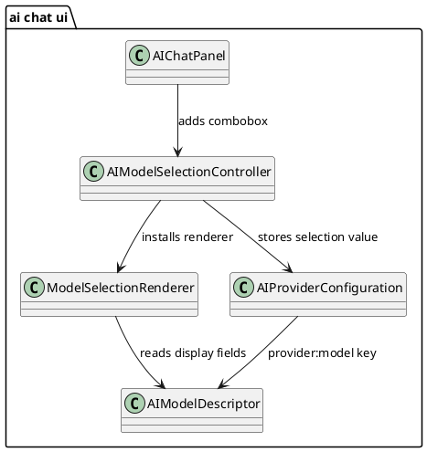

# Task: Show model name only in chat model combobox
- **Task Identifier:** 2026-02-16-model-name
- **Scope:** Update AI chat model selection presentation so the collapsed
  combobox shows only the model name and expands to available top-panel
  width, while preserving provider-aware selection behavior and stored
  configuration values.
- **Motivation:** The current selected combobox label includes provider and
  model text, which makes the toolbar control visually too wide and harder
  to scan.
- **Briefing:** Keep runtime behavior stable. Selection storage
  must continue to use provider plus model to avoid ambiguity. UI-only
  formatting should change in a minimal and localized way. No code until
  design suggestions are approved.
- **Research:**
  - `AIModelCatalog#buildDisplayName(...)` builds labels as
    `"<Provider>: <model>"` and appends `" (free)"` when relevant.
  - `AIModelSelectionController.ModelSelectionRenderer` uses different text
    for collapsed selected value (`index < 0`) and dropdown rows
    (`index >= 0`).
  - `AIModelDescriptor` already stores provider and model separately and
    exposes `getModelName()`, so UI can present model-only text without
    changing selection identity.
  - Selection persistence is based on provider plus model via
    `AIModelDescriptor#getSelectionValue()`, so display text changes can be
    kept non-breaking.
  - Top bar width behavior is controlled by layout container choice:
    `FreeplaneToolBar` kept selector effectively preferred-size-based,
    regular `JPanel` layout allows center expansion.
  - For renderer correctness, short text should be used for painting of the
    collapsed value, but preferred-size measurement should still use full
    dropdown text.
- **Design:**

  Introduce display-mode-aware rendering in
  `AIModelSelectionController.ModelSelectionRenderer`:
  - When rendering the collapsed selected value (`index < 0`), show only
    the substring after the first `'/'` in
    `AIModelDescriptor#getModelName()` when `'/'` exists; otherwise show
    the full model name.
  - When rendering dropdown rows (`index >= 0`), keep current rich label
    (`AIModelDescriptor#getDisplayName()`) to preserve provider context.
  - In `ModelSelectionRenderer`, preferred-size measurement uses full
    dropdown text for collapsed-value context via renderer state
    (`preferredSizeText` + `measuringPreferredSize`), while painted text
    stays shortened.
  - Keep selection identity and persistence unchanged
    (`provider:model` selection value remains authoritative).
  - Replace top `FreeplaneToolBar` row in `AIChatPanel` with regular panel
    layout:
    - menu button on the left,
    - model selector in center (fills available width),
    - history/new-chat buttons on the right.
  - Use regular `JComboBox` in `AIModelSelectionController` (no custom
    popup-width helper logic in this flow).
- **Test specification:**
  - **Automated tests:**
    - Add a focused renderer test that verifies collapsed rendering uses only
      model name.
    - Add a focused renderer test that verifies dropdown rows still show full
      display name.
    - Add a focused renderer test that verifies collapsed-value
      preferred-size path is measured against full dropdown text.
    - Add a focused selection test that verifies persisted selected model
      value remains provider plus model after UI text change.
    - Verify model selector remains functional after top-panel layout
      migration to regular panel.
  - **Manual tests:**
    - Open AI chat panel and confirm selected model text in the toolbar does
      not include provider prefix.
    - Confirm the selected combobox field expands to available top-panel
      width when panel width changes.
    - Open combobox dropdown and confirm entries still include provider text
      (and `(free)` marker where applicable).
    - Switch providers/models and confirm selected model is restored after
      reopening preferences or reloading panel.
