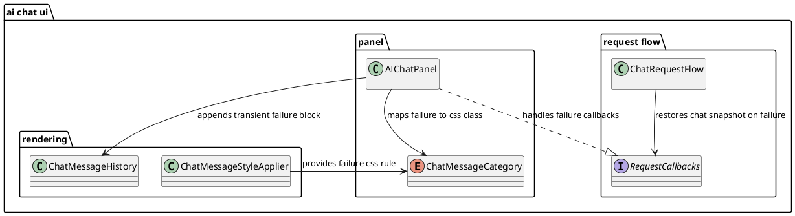

# Task: Show chat error notice on request failure
- **Task Identifier:** 2026-02-17-chat-error
- **Scope:** Show a visible transient failure block in the AI chat
  panel when a request fails and chat state is recovered from a saved
  snapshot. The block must contain both the restored user text and the
  failure notice. Add a dedicated red-accent style for the failure
  notice.
- **Motivation:** Current failure recovery removes the just-appended
  turn from chat history and returns user text to the draft field, but
  the user does not see why the response disappeared.
- **Scenario:** A user writes a message and sends it. The chat captures
  a snapshot of the current chat state, appends the user message to the
  visible history, and starts a model request.

  If the request succeeds, an assistant response is appended and the
  temporary snapshot is discarded.

  If the request fails, the chat restores state from the snapshot: chat
  memory is restored, history is rebuilt from restored transcript data,
  and the user text is returned to the draft field. Then a transient
  failure block is appended in the panel with restored user text and
  failure details. These transient messages are UI-only and are not
  persisted.

  If the user cancels an in-flight request, chat snapshot restoration is
  performed without adding failure messages.
- **Briefing:** Keep existing chat-state recovery behavior.
  Add transient UI feedback only: one transient item for restored user
  text and one transient item for failure details. Keep these messages
  UI-only (not persisted). Use chat/snapshot/failure terminology in
  naming and derive implementation naming from the Scenario.
- **Research:**
  - `ChatRequestFlow.restoreChatSnapshot()` truncates chat memory to
    the pre-request size, synchronizes transcript, rebuilds history from
    transcript, and restores user text in the draft field.
  - `AIChatPanel` currently handles `onAssistantError` by appending an
    assistant message, but `restoreChatSnapshot()` immediately rebuilds
    history from chat memory, so this message is removed from view.
  - Chat history rendering uses CSS classes from
    `ChatMessageStyleApplier`, which currently has no dedicated
    failure-specific class.
  - Chat history rebuild is transcript-based (`ChatMemoryHistoryRenderer`
    + `ChatMessageHistory.clear()`), so non-persistent notices must be
    re-appended after rebuild to remain visible in the UI.
- **Design:**

Use a transient UI-only failure rendering path in `AIChatPanel` for
failed assistant requests: after chat snapshot recovery and
transcript-based rebuild, append two transient messages to
`ChatMessageHistory`: restored user text and failure notice text. Do not
write these transient messages into `ChatMemory`, transcript entries, or
persisted chat history.

Introduce a new message CSS class with red accents (background and left
border) in `ChatMessageStyleApplier`, with light and dark theme color
variants. Add a dedicated chat category for the transient failure notice
so it does not reuse assistant styling.

Transient failure messages remain visible during normal append-only chat
updates (including next successful assistant response) and are removed
only by the next transcript-based full rebuild.

- **Test specification:**
  - Automated tests:
    - Extend `ChatRequestFlowTest` to verify failed requests still
      recover chat snapshot state and deliver failure text for UI
      handling.
    - Add/extend panel-level chat tests to verify failure recovery restores
      user text and appends exactly two transient messages in chat view
      (restored user text + failure notice).
    - Extend `ChatMessageStyleApplierTest` to verify the new
      failure-message CSS class rule is generated.
    - Verify history rebuild from transcript does not persist failure
      transient messages as chat memory/transcript messages.
  - Manual tests:
    - Trigger a model/provider failure and confirm user text returns to
      the draft field.
    - Confirm a red failure notice appears in chat panel and explains the
      failure reason.
    - Send a successful next request and confirm normal message flow
      remains unchanged.
