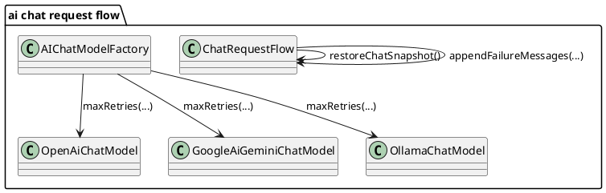

# Task: Retry chat requests only for transient failures
- **Task Identifier:** 2026-02-19-chat-retry-policy
- **Scope:** Remove application-level retry/classification logic from
  AI chat request flow and rely on built-in LC4J retry mapping in chat
  models. Keep chat snapshot restore, user text restore, failure message
  rendering, and cancellation behavior in `ChatRequestFlow`.
- **Motivation:** Retry policy already exists inside LC4J and is based
  on typed exception mapping. A second retry loop in chat flow duplicates
  retries, adds complexity, and makes behavior harder to reason about.
- **Scenario:** A user sends a message in the chat panel. The request
  flow captures a chat snapshot, appends the user message to chat, and
  starts a provider call.

  If the provider responds successfully, the assistant response is
  appended to chat and the snapshot is discarded.

  If the provider returns a failure, retries are handled inside LC4J
  model invocation according to LC4J exception mapping and configured
  retry count.

  If the request still fails after LC4J retries are exhausted, the
  request flow restores the captured chat snapshot, restores user text,
  and appends a chat failure message that explains the request failed.

  If the user cancels an in-flight request, the request flow restores the
  captured chat snapshot and user text without retry attempts.
- **Briefing:** Keep request UX behavior unchanged on terminal
  failure/cancel. Simplify `ChatRequestFlow` by removing app-level retry
  policy and exposing LC4J retry count in model builder configuration.
- **Research:**
  - LC4J `JdkHttpClient` throws `HttpException(statusCode, body)` for
    non-2xx responses.
  - LC4J `ExceptionMapper.DEFAULT` maps:
    - `5xx` -> `InternalServerException` (retriable),
    - `429` -> `RateLimitException` (retriable),
    - `408` -> `TimeoutException` (retriable),
    - `404` -> `ModelNotFoundException` (non-retriable),
    - `401/403` -> `AuthenticationException` (non-retriable),
    - other `4xx` -> `InvalidRequestException` (non-retriable).
  - OpenAI/Gemini/Ollama chat models use
    `withRetryMappingExceptions(...)` internally.
  - `maxRetries` is configurable on chat model builders and defaults to
    `2` when not set.
  - Current `AIChatModelFactory` does not set `maxRetries`, and current
    `ChatRequestFlow` has its own retry/classification logic, which can
    duplicate retries.
- **Design:**

Simplify request flow and keep retry policy in one place:
  - remove app-level retry/classification methods from `ChatRequestFlow`;
  - keep single provider call path in `SwingWorker`;
  - on terminal exception, keep existing normalization, snapshot restore,
    user text restore, and `appendFailureMessages(...)`;
  - keep cancellation behavior unchanged (no retry, restore snapshot);
  - set explicit `maxRetries` in `AIChatModelFactory` builders for
    OpenRouter/Gemini/Ollama to make retry count visible and controlled.
- **Test specification:**
  - Automated tests:
    - Verify `ChatRequestFlow` does not perform app-level retries
      (single call attempt per submitted request from this layer).
    - Verify terminal failure still restores chat snapshot, restores user
      text, and reports failure message.
    - Verify cancellation still restores chat snapshot/user text and does
      not report failure message.
    - Verify `AIChatModelFactory` sets `maxRetries` explicitly for
      OpenRouter/Gemini/Ollama builders.
  - Manual tests:
    - Trigger provider `5xx`/network instability and confirm eventual
      behavior uses LC4J retry (single visible user request flow with
      delayed final failure only after provider retries).
    - Trigger non-retryable provider failure (for example missing model)
      and confirm immediate terminal failure handling in chat panel.
