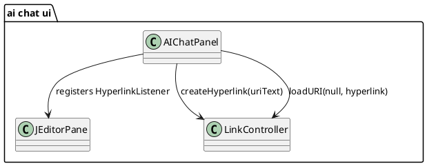

# Task: Open hyperlinks from chat message history
- **Task Identifier:** 2026-02-18-hyperlinks
- **Scope:** Add a click handler for links rendered in AI chat message
  history so clicking a URL opens it in the system browser.
- **Motivation:** Users can see link hover cursor in chat history, but
  links are not opened when clicked, which makes error/help URLs
  unusable.
- **Briefing:** Implement minimal hyperlink activation wiring
  for the existing `JEditorPane` history component. Keep rendering and
  persistence behavior unchanged.
- **Research:**
  - Chat history is rendered in a non-editable `JEditorPane` in
    `AIChatPanel`.
  - Messages are appended as HTML markup and can include markdown links.
  - Current panel setup does not attach a hyperlink listener for
    `messageHistoryPane`.
  - Existing Freeplane editors (`NotePanel`) use
    `LinkController.getController().loadURI(..., LinkController.createHyperlink(...))`
    for link activation.
  - `LinkController` path is broader than plain browser opening:
    internal node references (`#...`), Freeplane map references,
    `freeplane:`/`menuitem:`/`execute:` schemes, SMB/file handling, and
    external URL fallback.
- **Design:**

Register a hyperlink listener on the message history pane during panel
initialization. On hyperlink activation, parse target text with
`LinkController.createHyperlink(...)` and open via
`LinkController.getController().loadURI(...)` to preserve Freeplane link
semantics. Ignore non-activation events.

Use `loadURI(null, ...)` so chat links do not depend on current map
selection context. Silently ignore malformed links and keep chat
rendering/persistence unchanged.
- **Test specification:**
  - Automated tests:
    - Add/extend AI chat panel tests to verify hyperlink activation
      events invoke `LinkController.loadURI(...)` with hyperlink created
      from clicked text.
    - Verify non-activation hyperlink events do not trigger link
      loading.
    - Verify malformed link text does not throw and does not trigger link
      loading.
  - Manual tests:
    - Click a rendered URL in chat history and confirm it opens in the
      default browser.
    - Click an internal link format (`#node-id` or Freeplane map
      reference) and confirm Freeplane navigation behavior works.
    - Verify plain text and non-link message clicks do not trigger link
      actions.
