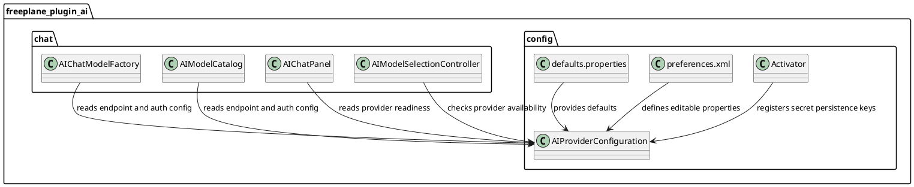

# Task: Enable Remote Ollama Token Authentication

- **Task Identifier:** 2026-02-20-ollama-token-auth
- **Scope:**
  Replace Ollama enablement via boolean/default-local endpoint with
  explicit endpoint configuration. Add token-based authentication for
  Ollama only, without custom header configuration fields.
- **Motivation:**
  Remote Ollama deployments commonly require token-based access.
  Current plugin behavior supports endpoint URL configuration but
  lacks token authentication and still carries local-only defaults.
- **Scenario:**
  A user configures a remote Ollama endpoint and provides an API token.
  Freeplane sends that token as Bearer authorization for chat and model
  discovery requests. If endpoint is not configured, Ollama is not
  considered available.
- **Briefing:**
  Keep changes focused to `freeplane_plugin_ai` provider configuration,
  preferences/defaults resources, model factory, model catalog, and
  related tests. Avoid unrelated provider refactors.
- **Research:**
  Current state:
  - `ai_ollama_service_address` defaults to
    `http://localhost:11434`.
  - Ollama availability is controlled by `ai_use_ollama`.
  - `AIChatModelFactory` sets Ollama `baseUrl` but does not set Bearer
    auth for Ollama.
  - `AIModelCatalog.fetchOllamaModels()` uses `HttpURLConnection`
    without auth headers for `/api/tags`.
  - LangChain4j `OllamaChatModel` builder supports
    `customHeaders(Map<String, String>)`.

  Constraints:
  - Keep scope to Ollama integration only.
  - Secrets must be persisted via the secrets file flow used by plugin
    activator.
- **Design:**

  Proposed behavior and structure:
  - Remove default value for Ollama endpoint property so it starts
    empty.
  - Remove `ai_use_ollama` usage and treat Ollama as enabled only when
    endpoint is non-empty.
  - Add `ai_ollama_api_key` as a secret property.
  - Build Ollama request headers from:
    `Authorization: Bearer <api key>` only when token is non-empty
    after trimming. If token is empty/blank, do not send an
    `Authorization` header.
  - Use Ollama Bearer auth in both:
    - `AIChatModelFactory` (`OllamaChatModel.builder().customHeaders`)
    - `AIModelCatalog.fetchOllamaModels()` (`HttpURLConnection`
      request headers).
  - Provider readiness checks in UI/controllers should use endpoint
    presence instead of removed boolean.
  - No custom header configuration is introduced in this task.
  - Update README to document actual property names and remote Ollama
    setup with token authentication.
- **Test specification:**
  Automated tests:
  - Extend `AIChatModelFactoryTest` to verify Ollama model receives
    Bearer auth headers and endpoint behavior when endpoint is missing.
  - Add explicit coverage that empty/blank Ollama token does not add
    `Authorization` header.
  - Add/extend `AIModelCatalogTest` to verify Bearer header propagation
    to
    Ollama model discovery request.
  - Add tests for provider readiness logic updates in
    `AIModelSelectionControllerTest` and/or `AIChatPanel`-related
    tests.

  Manual tests:
  - Configure remote Ollama endpoint with API key only; verify model
    list appears and chat works.
  - Leave endpoint empty; verify Ollama is not available in provider
    readiness and model selection.
