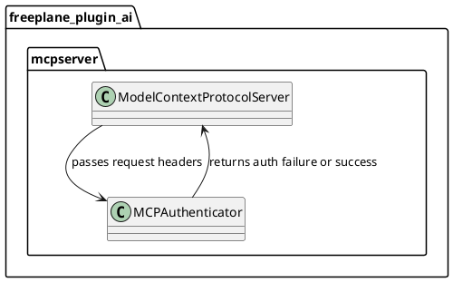

# Task: Extend MCP Authentication with Bearer Token Support

- **Task Identifier:** 2026-02-20-mcp-bearer
- **Scope:**
  Extend Freeplane MCP authentication to support
  `Authorization: Bearer <token>` while preserving compatibility with
  the existing custom token header.
- **Motivation:**
  Many MCP clients natively support Bearer authentication. Supporting
  Bearer improves interoperability while maintaining existing client
  setups.
- **Scenario:**
  An MCP client connects to Freeplane MCP and sends either
  `Authorization: Bearer <token>` or `X-Freeplane-MCP-Token: <token>`.
  Freeplane validates the configured token and authorizes the request
  when one supported header matches.
- **Briefing:**
  Keep changes focused to MCP server/authenticator classes and tests in
  `freeplane_plugin_ai`. Do not couple this work to provider model
  configuration changes.
- **Research:**
  Current state:
  - `ModelContextProtocolServer` defines `MCP_TOKEN_HEADER` as
    `X-Freeplane-MCP-Token`.
  - `MCPAuthenticator` validates a single configured header name.
  - On missing token configuration, a token is generated and persisted,
    then request is rejected.

  Constraints:
  - Backward compatibility for existing MCP clients using
    `X-Freeplane-MCP-Token` must be preserved.
  - Keep security behavior explicit and deterministic when multiple
    auth headers are provided.
- **Design:**

  Proposed behavior:
  - Accept auth token from either:
    - `Authorization: Bearer <token>`
    - `X-Freeplane-MCP-Token: <token>`
  - If both are present and non-empty, require equal token values.
  - Continue using existing token property (`ai_mcp_token`) and token
    generation behavior.
  - Keep unauthorized error payload format unchanged.
- **Test specification:**
  Automated tests:
  - Add/extend authenticator tests for:
    - valid Bearer token authentication.
    - valid legacy header authentication.
    - rejection when both headers are present and tokens differ.
    - rejection for invalid Bearer format.
  - Add integration-level coverage in MCP server tests to verify 401
    behavior remains consistent.

  Manual tests:
  - Connect using a client configured with Bearer token only and verify
    authorized request flow.
  - Connect using legacy custom header only and verify authorized
    request flow.
  - Provide mismatched values in both headers and verify unauthorized
    response.
