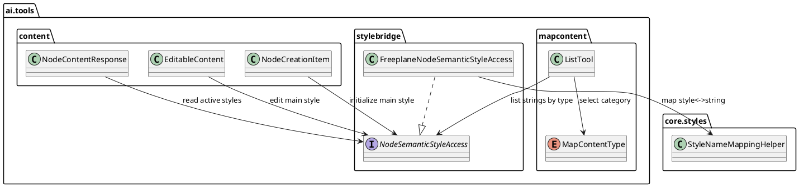

# Task: Expose node styles to AI tools
- **Task Identifier:** 2026-02-20-expose-styles-ai-tools
- **Scope:** Enable AI-facing map tools to read and write semantic style
  metadata without exposing full formatting internals. Add style fields
  to node read/edit/create payloads and replace icon-only availability
  discovery with a content-type based listing tool for icons and styles.
- **Motivation:** AI responses should reason about node semantics using
  styles. The model needs ordered active style names for a node, the
  ability to update the node's main style, and discoverable valid
  values for icons and styles from one consistent tool.
- **Scenario:** A user asks AI to align map semantics with team
  conventions. AI reads a node and sees ordered active style names, then
  updates the node's main style to a valid style from map metadata. When
  preparing edits or new nodes, AI can also request available values for
  `AVAILABLE_ICONS` or `MAP_STYLES` and choose valid strings.
- **Briefing:** Keep existing behavior backward-compatible for
  current consumers of icon availability and node payload fields.
  Preserve deterministic style ordering and explicit validation for
  style names when updating node main style. Do not introduce direct
  runtime dependency from AI plugin to script plugin; share logic via
  core helper APIs.
- **Research:**
  - Script API already exposes `node.style.getAllActiveStyles()` as an
    ordered list of style key strings and `node.style.setName(...)` for
    main style assignment.
  - Active style resolution includes node-local style data, conditional
    styles, and default style fallback, in deterministic order.
  - Existing AI tool surface currently has icon-specific availability
    listing and separate node content payload types (`NodeContentResponse`,
    `EditableContent`, `NodeCreationItem`) where style fields can be
    integrated.
  - A generic availability endpoint keyed by `MapContentType` can unify
    icons and styles discovery and remove dedicated icon-only listing
    tool duplication.
  - Script plugin already contains bidirectional style-name mapping
    logic that should be reused semantically (same accepted inputs and
    outputs) by extracting shared helpers into core code instead of
    cross-plugin calls.
- **Design:**

Add semantic fields to AI node payload contracts:
`activeStyles: List<String>` for ordered active style names,
`mainStyle: String?` for explicit logical style where applicable. Route
read/write operations through a dedicated style access layer that adapts
existing style APIs (`getAllActiveStyles`, `setName`). Replace
`listAvailableIcons` with `list(MapContentType)` returning `List<String>`
for `AVAILABLE_ICONS` and `MAP_STYLES`. Keep old tool wiring either
deprecated or redirected in one release step according to compatibility
policy.
Move style-name conversion/search logic currently duplicated in plugins
into a core helper (for example `StyleNameMappingHelper`) and have AI
and script integrations call that helper so both surfaces accept and
return style names consistently.
- **Test specification:**
  - Automated tests:
    - Tool test: node read returns ordered `activeStyles` for a node
      with explicit + conditional style activation.
    - Tool test: edit updates `mainStyle` and rejects unknown style
      names with stable validation error.
    - Unit test: shared core style-name helper resolves predefined,
      user-defined, and translated style names identically for both AI
      and script callers.
    - Tool test: create applies requested `mainStyle` to new node
      content.
    - Tool test: `list(AVAILABLE_ICONS)` returns icon names,
      `list(MAP_STYLES)` returns style names.
    - Compatibility test: previous icon-listing callers either get a
      deprecation path or equivalent behavior via redirect adapter.
  - Manual tests:
    - In a sample map with custom styles, ask AI to change a node's
      main style and verify rendered style semantics update.
    - Ask AI to enumerate available styles/icons and verify values match
      map data and can be reused in follow-up edit/create calls.
