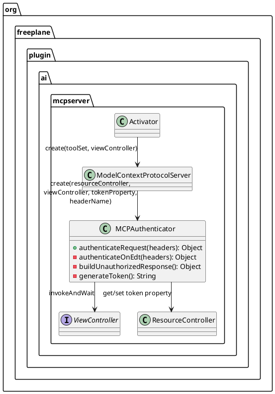
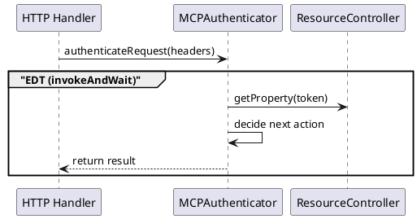

# Task: Stabilize Model Context Protocol authentication with explicit view controller
- **Task Identifier:** 2026-02-15-auth-validator
- **Scope:** Simplify Model Context Protocol request authentication so token
  generation, persistence, and user notification happen in one event-thread
  pass inside one authenticator component, while wiring the view controller
  explicitly from plugin startup.
- **Motivation:** Concurrent Model Context Protocol requests can trigger
  duplicate token generation and repeated user messages when authentication
  logic is split across threads or relies on dynamic global lookups.
- **Briefing:** Keep the change minimal and local to Model Context
  Protocol authentication flow. Preserve existing unauthorized response payload,
  keep server behavior unchanged for valid tokens, avoid singleton-based
  controller lookup in the startup path, and follow Tell, Don't Ask: the
  authenticator itself must generate, persist, and notify.
- **Research:**
  - `ModelContextProtocolAuthValidator.validateRequest(...)` is called from the
    HTTP handler before request dispatch.
  - Token generation and user notification occur in the same method path when
    the configured token is blank.
  - `ViewController.invokeAndWait(...)` executes immediately on EDT and uses
    `EventQueue.invokeAndWait(...)` from non-EDT threads.
  - Plugin startup has access to `modeController.getController()` and can pass
    `controller.getViewController()` at server creation time.
  - Existing tests cover unauthorized responses and integration server request
    handling; dedicated authenticator tests can assert one-time generation
    behavior under parallel calls.
- **Design:**

Authentication scenarios (plain language):
1. Token is empty:
  - `MCPAuthenticator` generates a new token.
  - `MCPAuthenticator` writes it to `ResourceController`.
  - `MCPAuthenticator` shows one message to the user with the generated token.
  - Current request is rejected with unauthorized response.
2. Token exists and header token matches:
  - Request is authorized (`null` is returned).
3. Token exists and header token does not match (or missing):
  - Request is rejected with unauthorized response.

`MCPAuthenticator` is the only class that performs request authentication and
token bootstrap side effects. It follows Tell, Don't Ask:
- When token is blank, `MCPAuthenticator` itself:
  - generates token (`UUID.randomUUID().toString()`),
  - writes it to `ResourceController`,
  - shows the token-generated user message.
- No token value is passed across layers for post-processing.

Threading and call contract:
- Public method: `Object authenticateRequest(Headers requestHeaders)`.
- It always executes auth logic via the captured `ViewController` using
  `invokeAndWait`.
- Sequence diagram omits `ViewController` as a participant intentionally and
  shows only the `EDT execution` block boundary.
- Returned value contract is unchanged:
  - `null` means request is authorized.
  - JSON-RPC unauthorized payload object means request is rejected.

Construction and dependency wiring:
- `Activator` creates `ModelContextProtocolServer` with
  `modeController.getController().getViewController()`.
- `ModelContextProtocolServer` creates `MCPAuthenticator` with explicit
  dependencies only: `ResourceController`, `ViewController`,
  token property name, header name.
- No singleton controller lookup in authentication flow.

Error handling design:
- If `invokeAndWait` is interrupted, interrupt flag is restored and
  `IllegalStateException` is thrown.
- Invocation exceptions are wrapped into `IllegalStateException`.
- Existing unauthorized payload structure remains unchanged.
- **Test specification:**
  - Automated tests:
    - `MCPAuthenticatorTest` verifies:
      - blank token generates once, persists once, and returns unauthorized;
      - matching header allows request;
      - missing header rejects request;
      - parallel requests generate and notify once when EDT serialization is
        applied.
    - `ModelContextProtocolServerIntegrationTest` verifies initialize/list/read
      flow still works and auth guard returns HTTP 401 without token header.
  - Manual tests:
    - Start Freeplane with Model Context Protocol enabled and empty token
      property.
    - Send first unauthorized request and confirm one token-generated dialog is
      shown.
    - Send multiple concurrent unauthorized requests and confirm no repeated
      token generation dialogs.
