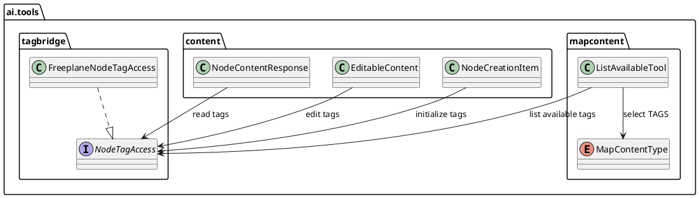
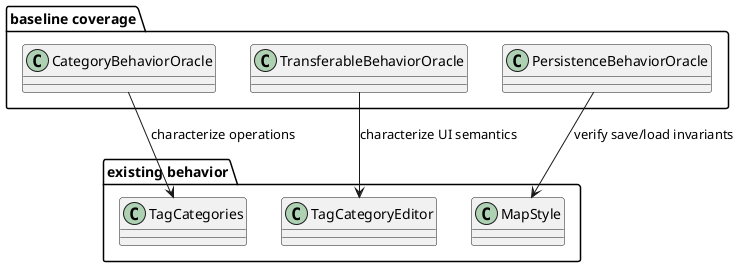
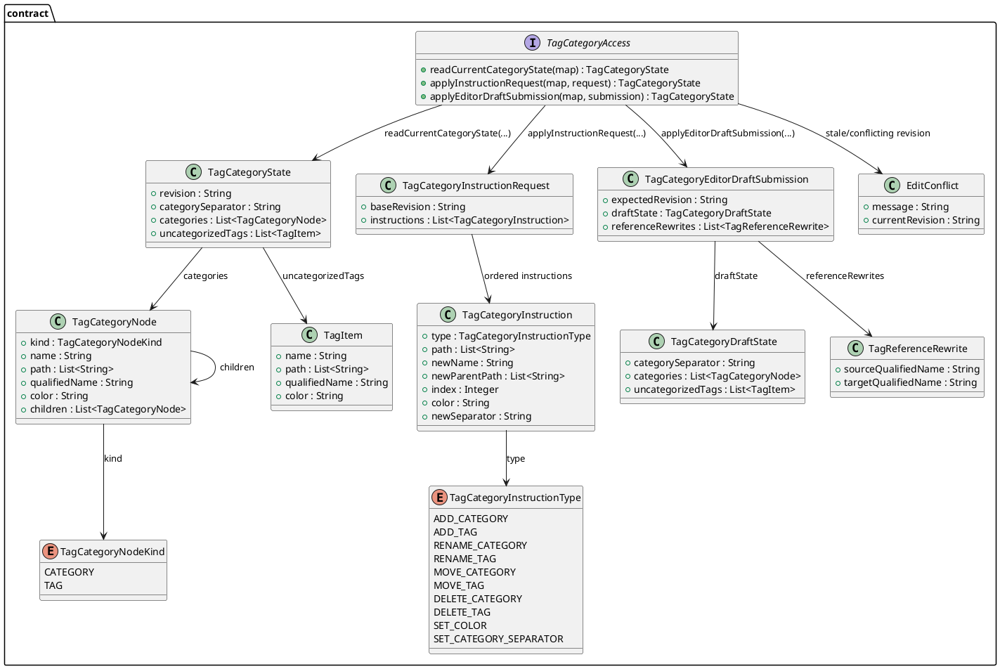
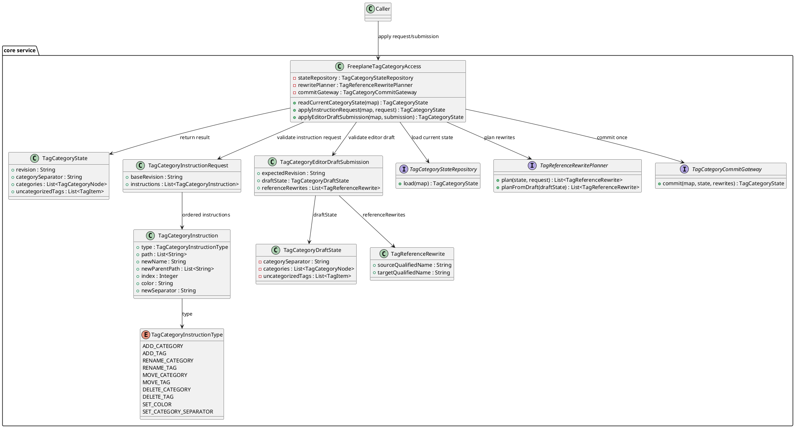
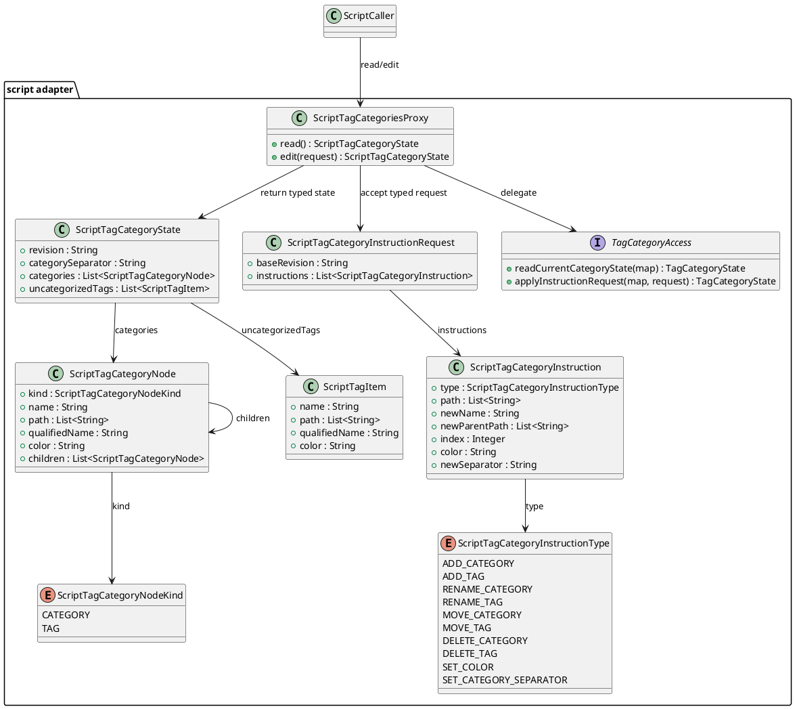
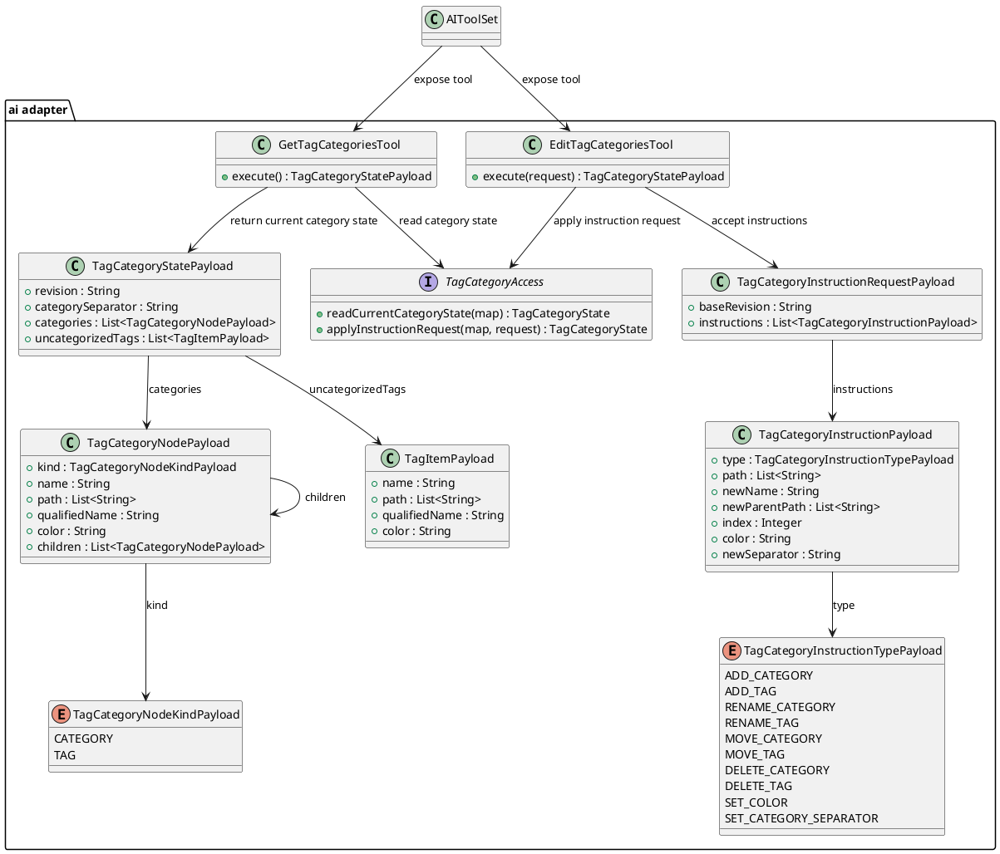
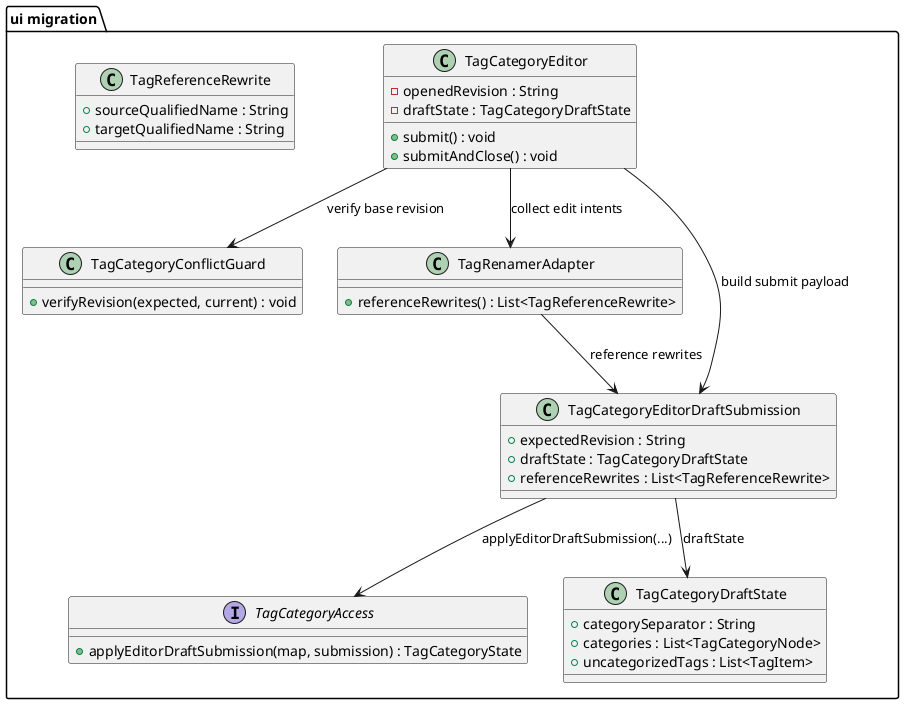

# Task: Expose node tags to AI tools
- **Task Identifier:** 2026-02-20-expose-tags-ai-tools
- **Scope:** Enable map-level and node-level access for both tag values and
  tag categories. Cover read and write operations needed by AI tools and
  scripting so category trees, category separator, and tag values can be
  managed without UI-only flows.
- **Motivation:** Tag categories are currently editable through UI flows,
  while script and AI paths mostly operate on node tag values. This blocks
  automation and makes category maintenance hard to integrate into AI and
  script workflows.
- **Scenario:** A user asks AI to normalize map tag categories. AI reads the
  current category state, updates category names and hierarchy, and then
  updates node tags to the new category structure. A script can perform the
  same map-level category operations without opening tag editor dialogs.
- **Constraints:**
  - Keep one shared read model and one shared commit/conflict boundary for
    UI, AI, and scripting.
  - Do not force UI and AI/script to share the same external write model if
    that would erase existing UI semantics.
  - Preserve indirect reference-update behavior and node-traversal-free
    steady-state category updates.
  - Public AI/script contracts must be explicit and typed; generic
    map-shaped payloads are not acceptable as the primary public surface.
  - Design must describe only the target system; current/as-is structures
    belong in Research.
- **Briefing:** Keep
  category and tag behavior deterministic, preserve undo semantics, and avoid
  bypassing existing reference-update logic in `TagCategories`.
  Category edit operations must remain node-traversal-free in steady state
  (no full map-node scan), except optional validation/debug-only modes.
- **Research:**
  - Node script API already exposes tag access through `node.tags`,
    providing existing read/write behavior that can be adapted for AI
    tool payloads.
  - The current style-focused task introduces a generic
    `listAvailable(MapContentType)` mechanism; tags should be added as a
    dedicated `MapContentType` branch (`TAGS`) rather than a separate
    endpoint.
  - Node payload contracts (`NodeContentResponse`, `EditableContent`,
    `NodeCreationItem`) are the expected integration points for adding
    semantic tag fields.
- **Design:**



Add `tags: List<String>` fields to relevant AI node payload contracts.
Read tags from node state for response payloads and support explicit tag
updates for edit/create flows. Extend `listAvailable(MapContentType)` to
handle `TAGS` and return map-available tag strings. Preserve a defined
ordering contract for returned tags and document replacement vs merge
semantics for writes.
- **Test specification:**
  - Automated tests:
    - Tool test: node read returns current tags with stable order.
    - Tool test: edit applies tag updates and removes tags when empty
      input is provided according to defined semantics.
    - Tool test: create applies requested tags to newly created nodes.
    - Tool test: `listAvailable(TAGS)` returns map-available tag names.
    - Regression test: tag operations do not change style fields
      (`mainStyle`, `activeStyles`) in payload responses.
  - Manual tests:
    - Use AI to rename and move a category subtree; verify category tree,
      node tags, and persistence after save/reload.
    - Use script API to update separator and resolve one intentional
      collision; verify rendered tags, filters, and category panel behavior.
    - Perform same edit sequence via UI and compare resulting category state with AI
      and script outputs for parity.

## Subtask: Characterization Coverage for Existing Category Behavior
- **Status:** review
- **Scope:** Expand automated tests that characterize current
  `TagCategories` and `TagCategoryEditor` behavior, including transferable
  copy/cut/paste, merge semantics, separator rewrites, and persistence.
- **Motivation:** Replacement work is high risk without a baseline that
  captures existing behavior as executable specifications.
- **Scenario:** A developer changes category-update internals and runs tests.
  If a rename/move/merge behavior differs from current semantics, tests fail
  before integration work continues.
- **Constraints:**
  - This subtask must not change behavior; it only captures the current
    oracle.
  - Characterization must cover externally relevant semantics, including odd
    UI-driven and placeholder-based rewrite cases.
  - Performance expectations belong in the baseline as observable
    constraints, not only as implementation assumptions.
- **Briefing:** Add
  tests first, avoid behavior changes, and keep baseline assertions explicit.
- **Research:**
  - Existing tests already cover several rename and merge paths but do not
    fully cover transferable paths, separator collisions, and cross-layer
    parity checks.
  - Current behavior intentionally relies on indirect `TagReference` updates
    instead of node-wise tag rewrites.
- **Design:**



Characterization tests define the behavior oracle used by subsequent
subtasks. They intentionally capture current semantics, including edge-case
merge outcomes.
- **Test specification:**
  - Automated tests:
    - TDD test list (Red -> Green):
      - [C1] Transferable copy/cut/paste preserves current internal move
        detection semantics.
      - [C2] Separator rewrite collisions and uncategorized migration match
        current behavior.
      - [C3] Map `<tags>` and node `TAGS` persistence roundtrip keeps
        equivalent state.
      - [C4] Category updates remain node-traversal-free in steady state.
    - Add tests for transferable copy/cut/paste paths with internal move
      detection.
    - Add tests for separator rewrite collisions and uncategorized migration.
    - Add tests for persistence roundtrip of `<tags>` category data and node
      `TAGS` data.
    - Add tests that verify no node-wise map traversal is required in steady
      state category updates.
  - Manual tests:
    - Open category editor, run representative rename/move/cut/paste actions,
      and verify visible behavior matches automated baseline outcomes.

## Subtask: Define Tag Category Access Contract
- **Status:** review
- **Scope:** Define the shared map-level category state, revision token,
  conflict signaling, deterministic ordering rules, and the two write input
  models:
  explicit instruction requests for AI/script and draft submission for UI.
  Define shared data structures consumable from script and serializable as
  JSON for AI tools.
- **Motivation:** Script and AI adapters need a stable non-UI mutation
  contract before implementation and wiring.
- **Scenario:** A script or AI caller reads current tag category state,
  prepares an ordered instruction list, and submits it with a base revision.
  The editor submits its local draft with the revision it was opened on.
  Contract validation decides whether to apply or reject atomically.
- **Constraints:**
  - Keep the contract independent from Swing classes, transferable payloads,
    and editor-local data structures.
  - One shared read model and one shared service boundary are required, but
    UI draft submit and AI/script instruction submit remain distinct write
    inputs.
  - Payloads and enums must be fully specified and self-describing; examples
    alone are insufficient.
  - Public contract naming must use category-state language rather than
    storage-oriented or transport-oriented terminology.
- **Briefing:** Keep the
  contract independent from Swing classes and transferable formats.
- **Research:**
  - Existing behavior can be mapped to explicit operations:
    create/rename/move/delete/setColor/setSeparator.
  - Current editor behavior implies batch-oriented apply semantics and
    conflict-sensitive merges.
  - AI tools already exchange JSON payloads; tag category state should be
    returned as tree-shaped JSON with explicit paths and domain-specific instruction
    names.
  - Script API should expose the same contract through typed proxy/value
    objects rather than a generic map surface.
- **Design:**



Contract artifacts define one shared read model and one shared service
boundary, but two write inputs:
instruction requests for AI/script and draft submission for UI.

AI/script external contract should expose one ordered instruction list over a
typed category-state model, not a generic `Map<String, Object>`.
Transport may still serialize to JSON, but the JSON must come from explicit
payload classes and domain names.
UI draft submission remains internal to the editor path and is not part of
the public scripting/AI contract.

AI edit request shape should be:

```json
{
  "baseRevision": "sha256:...",
  "instructions": [
    {
      "type": "RENAME_CATEGORY",
      "path": ["Project", "Status"],
      "newName": "State"
    },
    {
      "type": "MOVE_CATEGORY",
      "path": ["Project", "State"],
      "newParentPath": ["Meta"],
      "index": 0
    },
    {
      "type": "SET_CATEGORY_SEPARATOR",
      "newSeparator": "/"
    }
  ]
}
```

AI read response should be a category-state structure, for example:

```json
{
  "revision": "sha256:...",
  "categorySeparator": "::",
  "categories": [
    {
      "kind": "CATEGORY",
      "name": "Project",
      "path": ["Project"],
      "children": [
        {
          "kind": "CATEGORY",
          "name": "Status",
          "path": ["Project", "Status"],
          "children": []
        }
      ]
    }
  ],
  "uncategorizedTags": [
    {
      "name": "urgent",
      "path": ["urgent"]
    }
  ]
}
```

Script-facing API should wrap the same domain contract through typed proxies,
`map.tagCategories.read()` and `map.tagCategories.edit(request)`,
rather than exposing `Map<String, Object>` as the primary public surface.
- **Test specification:**
  - Automated tests:
    - TDD test list (Red -> Green):
      - [K1] Contract rejects missing required fields for category-state
        read/edit
        DTOs.
      - [K2] Category-state ordering is deterministic for identical category
        state.
      - [K3] Revision token is stable for unchanged state and changes after
        successful mutation.
      - [K4] Stale `expectedRevision` yields conflict without writes.
      - [K5] AI JSON category-state/instruction payloads serialize and
        deserialize
        losslessly.
    - Validate DTO required fields and operation constraints.
    - Validate deterministic category-state ordering and stable revision token
      generation.
    - Validate conflict signaling for stale revision token.
    - Validate JSON serialization/deserialization for AI category-state and
      edit
      batch payloads.
    - Validate script wrapper delegates to the same core contract behavior.
  - Manual tests:
    - N/A

## Subtask: Implement Core Tag Category Access Service
- **Status:** review
- **Scope:** Implement the contract-backed service behind one map-level commit
  boundary, preserving undo/redo and node-traversal-free category update
  behavior.
- **Motivation:** Centralizing category mutation logic removes UI coupling
  while keeping current performance and reference semantics.
- **Scenario:** An AI/script caller submits an ordered category instruction
  request, or the editor submits its current draft. The service applies the
  selected write model atomically, updates references indirectly, and commits
  once through undo-aware map controller flow.
- **Constraints:**
  - Preserve one atomic map-level commit boundary with optimistic revision
    checks before mutation.
  - Keep reference rewrites indirect and map-level; do not introduce
    node-wise rewrite passes in steady state.
  - Preserve undo/redo semantics and existing move-to-uncategorized
    flattening behavior unless explicitly redesigned later.
  - Support both approved write models without forcing a fake unification
    layer into the public API.
- **Briefing:** Keep reference rewrites indirect and map-level
  rather than node-wise.
- **Research:**
  - The target service still needs one map-level commit point with undo-aware
    apply semantics.
  - Reference rewrites remain indirect and map-level rather than node-wise.
  - Moving a non-leaf category subtree into uncategorized keeps the current
    flattening outcome as an intentional domain rule.
- **Design:**



Service applies edits to a working category state and performs one final
commit to maintain undo and map-change notification behavior.
`MOVE` into uncategorized remains an explicit domain rule: moving a non-leaf
subtree flattens moved paths to uncategorized tags while keeping reference
rewrites deterministic.
Service exposes both write models:
`applyInstructionRequest(...)` for AI/script and
`applyEditorDraftSubmission(...)` for UI draft commit.
- **Test specification:**
  - Automated tests:
    - TDD test list (Red -> Green):
      - [S1] Core service applies `ADD`, `DELETE`, `RENAME`, `MOVE`,
        `SET_COLOR`, and `SET_SEPARATOR` correctly.
      - [S1a] `MOVE` of non-leaf subtree to uncategorized flattens moved
        paths and rewrites references with UI-equivalent outcomes.
      - [S1b] Core `applyEditorDraftSubmission(...)` preserves current submit
        behavior: single commit, reference rewrites, and stale-revision
        reject.
      - [S2] Mixed batch apply is atomic when one operation fails.
      - [S3] Stale revision conflict performs zero writes.
      - [S4] Undo/redo restores exact pre/post states.
      - [S5] Apply path performs no full map-node traversal in steady state.
      - [S6] Core results match characterization oracle scenarios.
    - Apply create/rename/move/delete/setColor/setSeparator operations.
    - Verify atomicity when one operation in the batch fails.
    - Verify stale revision conflict path performs no writes.
    - Verify undo/redo parity with current category commit semantics.
    - Verify no full map-node traversal in steady-state apply flow.
  - Manual tests:
    - Run one mixed edit batch and verify map refresh and undo/redo behavior.

## Subtask: Expose Map-Level Tag Categories to Scripting
- **Status:** review
- **Scope:** Add script API surface for reading and applying map-level
  category edits through the shared access service.
- **Motivation:** Scripts currently can edit node tags only; map category
  management needs parity with UI capabilities.
- **Scenario:** A script reads current tag category state, renames a category
  subtree, and applies edits without opening dialogs.
- **Constraints:**
  - Script API must be typed and domain-facing, not generic-map-based.
  - Scripting exposes category-state read and explicit instruction apply
    only; editor draft semantics stay internal.
  - Existing node-tag scripting behavior must remain unchanged.
- **Briefing:** Keep
  script API thin and delegate behavior to the shared service.
- **Research:**
  - `TagsProxy` currently exposes only node-level tags.
  - Map-level category APIs are absent in script proxies.
  - Generic map-shaped payloads are too implicit for the scripting public API;
    script callers need named methods and typed proxy/value objects.
- **Design:**



Script adapter introduces no mutation logic of its own; it forwards validated
requests to the core service. Public scripting API should use named methods
and typed proxy/value objects such as `map.tagCategories.read()` and
`map.tagCategories.edit(request)`, not `Map<String, Object>` as the primary
surface.
- **Test specification:**
  - Automated tests:
    - TDD test list (Red -> Green):
      - [P1] Script `read()` returns deterministic category-state payload.
      - [P2] Script `edit(...)` executes ordered instruction semantics.
      - [P3] Script surfaces stale revision conflicts from shared service.
      - [P4] Script outcomes match characterization parity scenarios.
    - Script read returns deterministic category state.
    - Script write applies edit batches and updates references.
    - Script results match baseline category-state oracle for equivalent
      edits.
  - Manual tests:
    - Execute sample script on a map and verify category tree and node tags.

## Subtask: Expose Map-Level Tag Categories to AI Tools
- **Status:** review
- **Scope:** Add AI tool requests/responses for reading current tag category
  state and applying ordered edit instructions, using the same shared access
  service.
- **Motivation:** AI currently edits node tag values but cannot manage map
  categories directly.
- **Scenario:** AI reads the current map tag category state, proposes
  category edits, and applies them atomically with revision conflict
  handling.
- **Constraints:**
  - AI tools must expose explicit request/response payloads with full
    schema, including enums and revision token.
  - Tool descriptions must describe category editing semantics, not
    internal storage details.
  - AI writes go through explicit instruction requests, never through UI
    draft payloads.
  - Existing node-tag AI tools must remain behaviorally unchanged.
- **Briefing:** Keep AI
  DTOs explicit and avoid leaking UI-centric transferable formats.
- **Research:**
  - Current AI tools include node tag read/edit but no map category tool.
  - Existing list tools do not expose map category structures.
  - AI tool descriptions should explain category editing as a domain action;
    revision handling is a protocol detail, not the user-facing purpose of
    the tool.
- **Design:**



AI tool layer stays declarative; all mutation semantics are centralized in
the shared service. Tool names and descriptions should be phrased as:
`get_tag_categories` and `edit_tag_categories`. `revision`/`baseRevision`
remain part of the payload for conflict handling, but the primary API story
is reading and editing current map tag categories.
- **Test specification:**
  - Automated tests:
    - TDD test list (Red -> Green):
      - [A1] AI read tool returns JSON category state with revision.
      - [A2] AI edit tool applies ordered instructions and returns updated
        category state.
      - [A3] AI edit tool returns conflict on stale revision without writes.
      - [A4] AI payload ordering and identity fields remain deterministic.
      - [A5] AI outcomes match script/core parity scenarios.
    - Tool read returns category state with deterministic order and revision
      token.
    - Tool write applies batch edits and returns updated category state.
    - Stale revision requests return conflict errors without writes.
    - AI results match baseline parity scenarios.
  - Manual tests:
    - Ask AI to rename and move categories, then verify map state and undo.

## Subtask: Migrate Tag Category Editor to Shared Service
- **Status:** review
- **Scope:** Rewire `TagCategoryEditor` to call shared category access
  operations while preserving existing UI interactions, transferable support,
  and visible behavior.
- **Motivation:** UI should become a caller of the same domain API used by
  script and AI to eliminate duplicated mutation orchestration.
- **Scenario:** User edits categories in the current dialog; submission
  stays draft-based and is applied through shared service with identical
  observable outcomes.
- **Constraints:**
  - Preserve the existing editor interaction model and trial-and-error
    semantics while changing the submit boundary.
  - Editor remains a draft-based caller; do not force it to emit the
    AI/script instruction model.
  - Stale external updates discard local draft state and hard-reload the
    editor to the latest map category state.
  - Legacy replacement-pair placeholder behavior must stay compatible with
    the shared submit path.
- **Briefing:** Preserve
  existing keyboard, drag/drop, and transferable interaction UX.
- **Research:**
  - Current editor contains non-local mutation bookkeeping (`TagRenamer`,
    `lastSelectionParentsNodes`) tightly coupled to tree events.
  - Shared service migration is required for true parity across callers.
- **Design:**



UI keeps interaction patterns but delegates final mutation semantics to the
shared service for parity and maintainability.
On stale revision conflicts, UI policy is to discard the local unsaved draft
and reload from latest state immediately, rather than attempting in-dialog
merge of transient tree-event state.
Migration is incremental:
1. Add revision conflict guard in `submit()` and reject stale apply without
   writing map categories.
2. Keep current transferable/copy tree behavior unchanged while switching final
   apply path to shared access operations.
3. Delegate `submit()` to `TagCategoryAccess.applyEditorDraftSubmission(...)`
   using explicit editor draft submission payload (opened revision +
   category draft state + reference rewrites), keeping conflict reload policy
   unchanged.
- **Test specification:**
  - Automated tests:
    - TDD test list (Red -> Green):
      - [U1] Existing `TagCategoryEditorTest` scenarios pass unchanged.
      - [U2] Transferable copy/cut/paste UX behavior stays equivalent.
      - [U3] External update conflict rejects stale submit and hard-reloads
        latest category state.
      - [U4] UI results remain parity-equivalent to script/AI outputs.
      - [U3a] `submit()` rejects stale revision and does not call
        the commit gateway.
      - [U3b] Conflict path discards local draft and reopens editor on latest
        category state.
      - [U3c] `submit()` delegates draft payload to shared access service,
        including opened revision and reference rewrites.
    - Existing `TagCategoryEditorTest` scenarios continue to pass.
    - Transferable copy/cut/paste behavior remains unchanged.
    - UI results match script/AI category states for equivalent edit
      sequences.
    - External update conflict path rejects stale submit and reloads editor
      state to latest category state.
  - Manual tests:
    - Execute representative category-edit workflows in dialog and verify no
      UX regressions.
    - While editor is open, apply an external category change and verify
      immediate editor reload with stale-draft discard notice.
