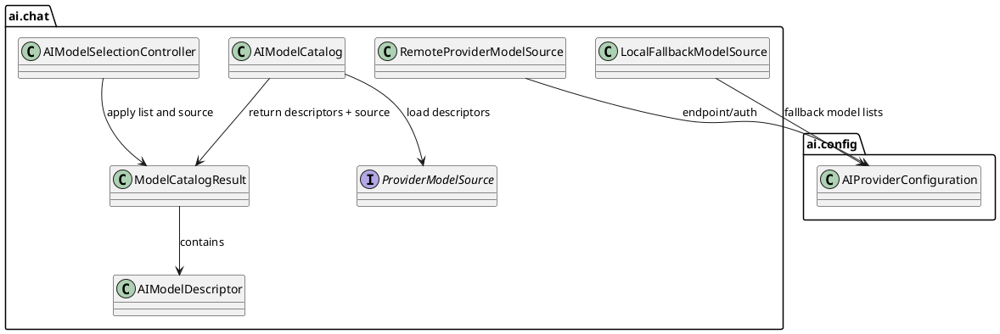

# Task: Fallback model selection when provider model discovery fails
- **Task Identifier:** 2026-03-15-provider-model-discovery-fallback
- **Scope:** Keep chat model selection usable when a configured provider
  cannot return a remote model list. Instead of treating model
  discovery as mandatory, use a local fallback catalog for supported
  providers and let the first real model invocation validate whether a
  chosen model is accepted by the remote service.
- **Motivation:** Some OpenAI-compatible or Ollama-compatible services
  can serve chat requests but do not expose a compatible model-list
  endpoint, block it, or require different permissions. Today
  `AIModelCatalog` collapses to an empty list for OpenRouter and Ollama
  when discovery fails, which makes model selection unusable even when
  the service could process requests for known model identifiers.
- **Scenario:** A user points the OpenRouter-compatible endpoint to a
  third-party service. The service accepts chat completions for
  `openai/gpt-4.1-mini` but returns an error for `/models`. Freeplane
  should still show a local candidate model list, allow the user to
  pick one, and only surface an incompatibility error if the actual
  chat request rejects that model identifier.
- **Constraints:** Keep successful remote discovery authoritative
  when it is available. Treat fallback as a whole-list decision: use
  the remote list when it is non-empty, otherwise use the fallback
  list. Use existing configured model-list entries as the fallback
  source, but
  only for literal model identifiers. Wildcard entries remain filtering
  rules and must not generate fallback candidates.
- **Research:**
  - `AIModelCatalog#getAvailableModels(boolean)` currently aggregates
    OpenRouter, Gemini, and Ollama descriptors. Gemini already uses a
    local configured model list, while OpenRouter and Ollama fetch
    remote lists and return an empty result on fetch failure.
  - `AIModelSelectionController` clears the combobox selection when the
    refreshed descriptor list does not contain the stored model. An
    empty discovery result therefore makes the configured model
    effectively unselectable even if the provider could serve it.
  - Existing configuration already stores Gemini models as a direct
    model list and stores OpenRouter/Ollama entries as allowlist text.
    For fallback purposes, literal OpenRouter/Ollama entries can serve
    as candidate model identifiers, while wildcard entries such as `*`,
    `openai/*`, or `gemini-*` cannot identify a concrete remote model
    and therefore must be ignored for fallback catalog population.
  - `AIModelCatalogTest` already covers parsing, filtering, and
    discovery retry behavior, so fallback behavior can be specified as a
    catalog-level contract with focused coverage for selection
    persistence.
- **Design:**

Use existing configured provider model entries as the fallback source
for discovery-based providers. For OpenRouter and Ollama, derive
fallback candidates from literal allowlist entries only and ignore any
entry containing wildcard syntax. `AIModelCatalog` should first try
remote discovery; if that returns a non-empty list, use it as-is. If
discovery fails or returns no usable models, build the list from the
configured literal fallback entries instead. `AIModelSelectionController`
should preserve a stored selection when the selected model exists in
the resulting list. Runtime validation of provider/model compatibility
stays at request execution time; discovery fallback must not add a
preflight rejection layer beyond syntax-level selection parsing.
- **Test specification:**
  - Automated tests:
    - Catalog test: OpenRouter-compatible discovery failure with a
      configured fallback list returns local descriptors instead of an
      empty list.
    - Catalog test: successful remote discovery continues to win over
      fallback entries for the same provider.
    - Catalog test: fallback entries are built only from literal
      configured model-list items and ignore entries containing
      wildcard syntax.
    - Controller test: stored provider/model selection remains selected
      when present in the fallback list used after discovery failure.
    - Regression test: providers without fallback configuration still
      behave as they do today when discovery fails.
  - Manual tests:
    - Configure an OpenRouter-compatible endpoint that rejects
      `/models`, provide a fallback model list, open the chat panel, and
      verify the selector remains populated.
    - Pick a fallback model that the remote service supports and verify
      a chat request succeeds.
    - Pick a fallback model that the remote service rejects and verify
      the chat error reports model incompatibility without clearing the
      configured model list.
