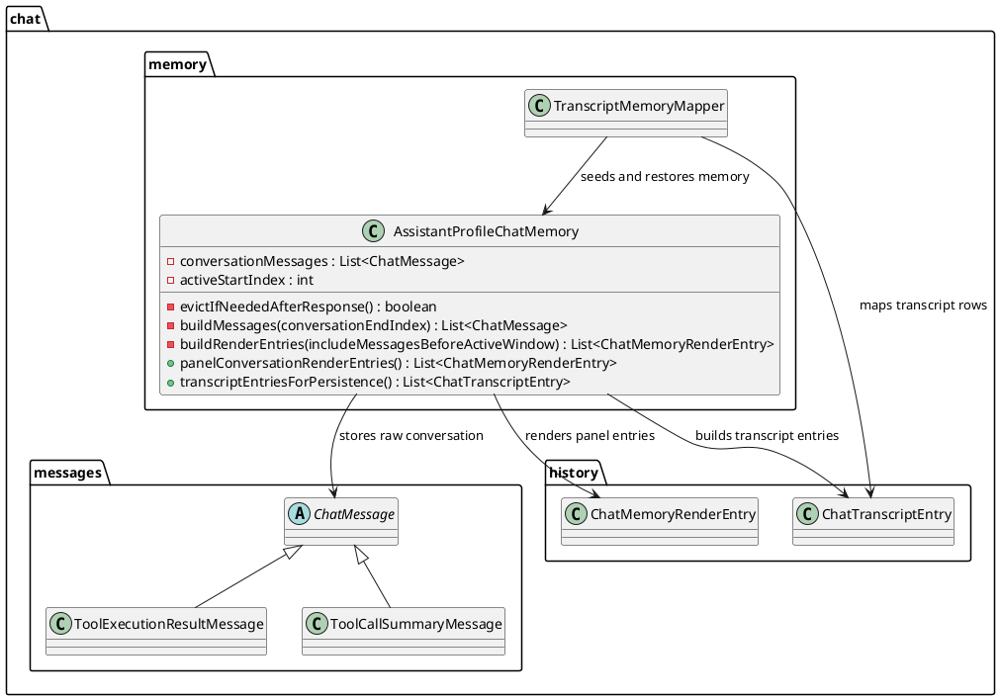
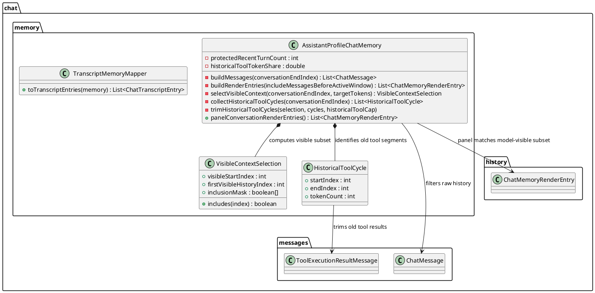
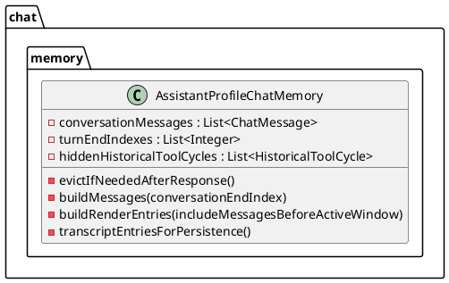
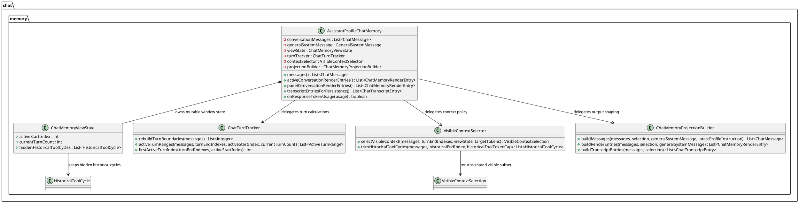

# Task: Limit historical tool messages in chat context
- **Task Identifier:** 2026-03-18-tool-context
- **Scope:** Keep more historical `user`/`assistant` dialog in active
  chat context by applying a separate token budget to older tool call
  and tool result messages before evicting whole older turns. Align the
  chat panel history with the exact message subset currently visible to
  the model.
- **Motivation:** The current chat memory eviction moves the active
  window by whole turns after a response. Older tool-heavy turns consume
  context budget that could otherwise preserve more user questions and
  assistant answers. After transcript restore, the old context is
  already more dialog-focused because tool messages are not restored, so
  live chat and restored chat diverge in what context they preserve.
- **Scenario:** A user has a long chat where older turns include tool
  requests and tool results. The newest turn, including the latest user
  message, all tool work, and the final assistant answer, must remain
  intact. In older turns, historical tool messages should be hidden
  first when they exceed their budget share so that more older
  `user`/`assistant` dialog remains available to the model. The user
  should see the same active history that the model sees; hidden
  historical tool messages can reappear later if undo or another window
  expansion makes them active again.
- **Constraints:**
  - Preserve the raw chat history in memory; do not physically delete
    hidden historical tool messages.
  - The latest active turn must remain complete, including the latest
    user message, tool requests, tool results, and final assistant
    reply.
  - The visible chat panel history must match the message subset sent to
    the model for the active window.
  - Historical tool budget must be expressed as explicit parameters,
    not as an implicit side effect of turn eviction.
  - Whole-turn eviction remains the fallback when tool trimming alone
    cannot reach the target context size.
- **Briefing:** The main logic lives in
  `freeplane_plugin_ai/.../AssistantProfileChatMemory.java`.
  `conversationMessages` stores the raw history; `activeStartIndex`
  defines the visible window. Current post-response compaction reduces
  over-limit history to `maxTokens / 4` by advancing the window one full
  turn at a time. `messages()` builds the model-visible context, while
  `panelConversationRenderEntries()` currently renders the full raw
  history plus a removed-for-space marker. `TranscriptMemoryMapper`
  persists mostly `user`/`assistant` exchanges, which is why restored
  chats already keep more dialog than live chats.
- **Research:**

  - `AssistantProfileChatMemory.evictIfNeededAfterResponse()` trims only
    by moving `activeStartIndex` across full turn boundaries.
  - Turn boundaries end at the final `AiMessage` in a tool cycle, so
    old tool requests and tool results remain bundled with old dialog
    until the whole turn is evicted.
  - Token estimation currently counts `UserMessage`, `AiMessage`, and
    `ToolExecutionResultMessage`, but excludes UI-only
    `ToolCallSummaryMessage`.
  - `buildMessages()` already suppresses `ToolCallSummaryMessage` from
    model input, while `panelConversationRenderEntries()` still renders
    the full raw history before the active window.
  - Transcript persistence omits tool summaries and tool execution
    details, preserving mostly `user`/`assistant` history plus the
    removed-for-space marker.
- **Design:**

  - Keep the implementation local to `AssistantProfileChatMemory`; do
    not add new top-level classes for this task.
  - Add explicit active-context parameters with builder defaults:
    `protectedRecentTurnCount = 1` and
    `historicalToolTokenShare = 0.5`.
  - Trigger post-response compaction only when the active context exceeds
    `maxTokens`.
  - For post-response compaction, use
    `targetTokens = maxTokens / 4` as the comparison target for
    visible-context trimming.
  - Apply `historicalToolTokenShare` only to the historical part of the
    visible context, not to the protected newest turns.
  - In `selectVisibleContext(...)`, `targetTokens` means the caller's
    actual trimming target.
  - For a given `targetTokens`, compute
    `protectedTokens` as the token usage of the newest
    `protectedRecentTurnCount` turns kept intact.
  - Then compute
    `historicalTokens = max(0, targetTokens - protectedTokens)` and
    `historicalToolTokenCap = historicalTokens * historicalToolTokenShare`.
  - Count only old tool-cycle messages against
    `historicalToolTokenCap`; old `user`/final-`assistant` dialog does
    not count against that cap.
  - While selecting visible history, hide the oldest historical tool
    cycles until the sum of tokens for the remaining visible historical
    tool cycles is less than or equal to `historicalToolTokenCap`.
  - Introduce a visible-context selection layer on top of raw
    `conversationMessages` instead of relying only on `activeStartIndex`.
  - Use a new private entry point such as
    `selectVisibleContext(int conversationEndIndex, int targetTokens)`.
  - Return a small private helper object such as
    `VisibleContextSelection` with
    `visibleStartIndex`,
    `firstVisibleHistoryIndex`,
    and a per-message inclusion mask for the active range.
  - Add a second helper such as `HistoricalToolCycle` describing one old
    tool cycle by `startIndex`, `endIndex`, and `tokenCount`.
  - Define a historical tool cycle as the assistant tool-request message
    plus its following tool-result messages inside an older turn.
  - The selection algorithm should reserve the newest
    `protectedRecentTurnCount` turns intact.
  - The selection algorithm should compute
    `historicalTokens` and `historicalToolTokenCap` from the remaining
    target tokens after the protected turns.
  - The selection algorithm should build historical tool cycles with a
    method such as `collectHistoricalToolCycles(...)`.
  - The selection algorithm should hide the oldest cycles first with a
    method such as `trimHistoricalToolCycles(...)` until historical tool
    usage fits within `historicalToolTokenCap`.
  - If the resulting visible context still exceeds the target size, keep
    the existing whole-turn fallback in `evictIfNeededAfterResponse()`.
  - Replace direct iteration over `conversationMessages` in both
    `buildMessages(...)` and `buildRenderEntries(...)` with iteration
    over the shared `VisibleContextSelection`.
  - Keep hidden raw messages available for undo/redo and future window
    expansion.
- **Test specification:**
  - Automated tests:
    - Verify a tool-heavy old history hides historical tool cycles
      before evicting an additional older dialog turn.
    - Verify the newest protected turn remains complete even when it
      contains tool requests and tool results.
    - Verify `messages()` and panel render entries expose the same
      visible historical subset, with hidden historical tool messages
      omitted from both.
    - Verify undo or other window expansion restores previously hidden
      historical tool messages when they become active again.
    - Verify whole-turn eviction still occurs after tool trimming when
      the target token budget is still exceeded.
    - Verify transcript persistence and restore remain consistent with
      the new visible-context behavior.
  - Manual tests:
    - Run a long tool-heavy chat and confirm older tool messages vanish
      before older user/assistant dialog disappears.
    - Open a restored chat and confirm the visible historical context is
      consistent with the live-chat compaction rules.

## Subtask: Refactor AssistantProfileChatMemory
- **Status:** backlog
- **Scope:** Reduce the size and responsibility count of
  `AssistantProfileChatMemory` by extracting focused collaborators
  without changing chat behavior, persistence behavior, or public API
  semantics.
- **Motivation:** `AssistantProfileChatMemory` now mixes raw
  conversation storage, turn-boundary tracking, visible-context
  selection, post-response compaction, transcript shaping, panel
  shaping, and token accounting. That makes the class hard to review,
  test, and change safely.
- **Constraints:**
  - Preserve current external behavior and existing test expectations.
  - Keep the existing public entry points on `AssistantProfileChatMemory`
    unless a follow-up task explicitly approves API changes.
  - Prefer package-private extracted classes in the same package over
    adding new public surface.
  - Do not change transcript format, undo/redo semantics, or token
    accounting rules in this refactor.
- **Research:**

  - `AssistantProfileChatMemory` currently owns both state and policy.
  - The longest private areas are turn tracking, visible-context
    selection, and view/transcript projection.
  - The recent historical-tool trimming added more policy/state coupling
    inside the same class instead of reducing it.
- **Design:**

  - Keep `AssistantProfileChatMemory` as the orchestration entry point.
  - Extract mutable window-related state into `ChatMemoryViewState`:
    `activeStartIndex`, `currentTurnCount`, and hidden historical tool
    cycles.
  - Extract turn-boundary and active-range calculations into
    `ChatTurnTracker`.
  - Extract visible-context policy, including historical tool trimming,
    into `VisibleContextSelector`.
  - Extract prompt/render/transcript projection from raw messages plus
    `VisibleContextSelection` into `ChatMemoryProjectionBuilder`.
  - Keep token estimation in `AssistantProfileChatMemory` for this step
    unless extraction becomes trivial during implementation.
  - Refactor in behavior-preserving steps:
    1. extract `ChatMemoryViewState`,
    2. extract `ChatTurnTracker`,
    3. extract `VisibleContextSelector`,
    4. extract `ChatMemoryProjectionBuilder`,
    5. rerun the existing test suite after each step.
- **Test specification:**
  - Automated tests:
    - Keep the current `AssistantProfileChatMemoryTest` and
      `TranscriptMemoryMapperTest` green without behavior changes.
    - Add focused tests for each extracted collaborator where that
      reduces fixture complexity.
    - Verify the refactor does not change transcript boundaries, panel
      history, undo/redo results, or post-response compaction behavior.
