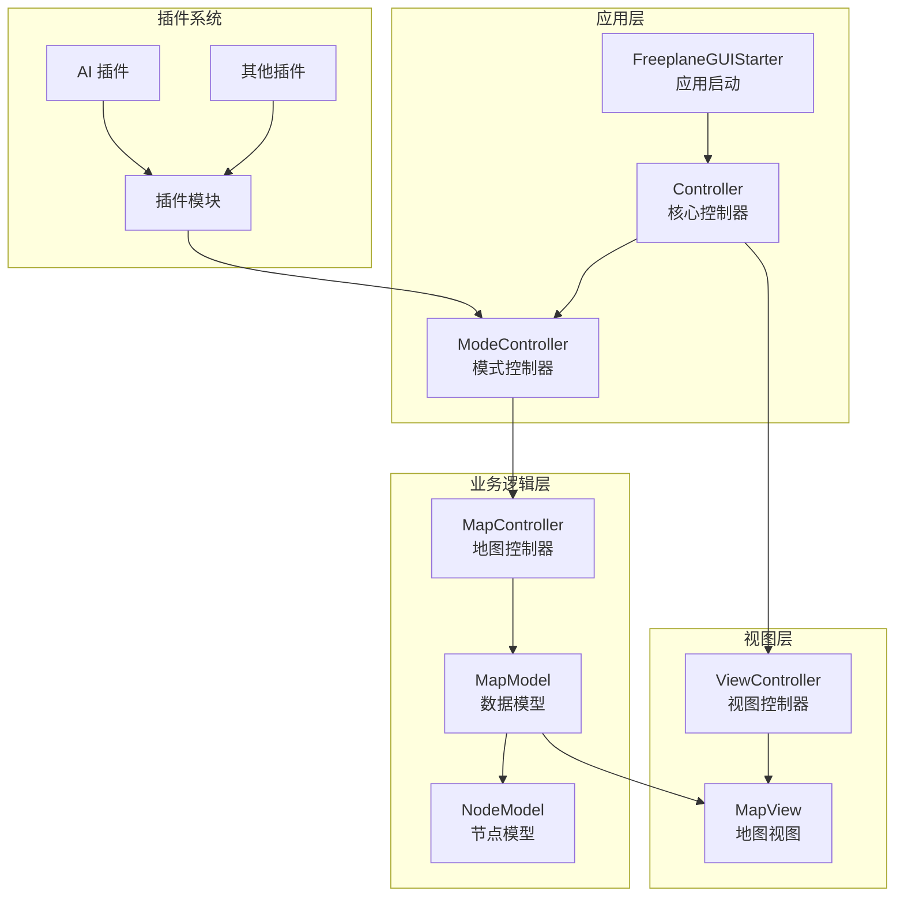

# Freeplane 项目架构文档

## 1. 核心架构

Freeplane 是一个基于 Java 的思维导图编辑器，采用模块化、可扩展的架构设计。项目使用 Gradle 进行构建，采用多模块结构组织代码。

### 1.1 架构层次

### 1.2 核心组件

| 组件 | 职责 | 位置 |
|------|------|------|
| FreeplaneGUIStarter | 应用启动入口，负责初始化环境和创建控制器 | freeplane/src/main/java/org/freeplane/main/application/FreeplaneGUIStarter.java |
| Controller | 核心控制器，管理模式、扩展和生命周期 | freeplane/src/main/java/org/freeplane/features/mode/Controller.java |
| MapModel | 思维导图数据模型，管理节点和地图状态 | freeplane/src/main/java/org/freeplane/features/map/MapModel.java |
| NodeModel | 节点数据模型，存储节点属性和子节点 | freeplane/src/main/java/org/freeplane/features/map/NodeModel.java |
| MapView | 思维导图视图，负责渲染和用户交互 | freeplane/src/main/java/org/freeplane/view/swing/map/MapView.java |
| ModeController | 模式控制器，管理不同工作模式 | freeplane/src/main/java/org/freeplane/features/mode/ModeController.java |

## 2. 模块职责

### 2.1 核心模块

| 模块 | 职责 | 主要功能 |
|------|------|----------|
| freeplane | 核心应用模块 | 实现思维导图编辑的核心功能，包括数据模型、视图渲染、用户交互等 |
| freeplane_api | API 模块 | 提供公共 API 接口，供插件和外部应用使用 |
| freeplane_framework | 框架模块 | 提供应用框架支持，包括启动脚本、配置文件等 |
| freeplane_web | Web 版本 | 基于 Vue.js 的 Web 界面实现 |

### 2.2 插件模块

| 插件 | 职责 | 功能描述 |
|------|------|----------|
| freeplane_plugin_ai | AI 插件 | 集成 AI 功能，提供智能助手、内容生成等能力 |
| freeplane_plugin_bugreport | 错误报告 | 提供错误报告功能 |
| freeplane_plugin_formula | 公式插件 | 支持数学公式编辑 |
| freeplane_plugin_latex | LaTeX 插件 | 支持 LaTeX 语法 |
| freeplane_plugin_markdown | Markdown 插件 | 支持 Markdown 语法 |
| freeplane_plugin_script | 脚本插件 | 支持脚本扩展功能 |
| freeplane_plugin_svg | SVG 插件 | 支持 SVG 图形 |

## 3. 数据流

### 3.1 启动流程

1. **应用启动**：FreeplaneGUIStarter 初始化环境，创建 Controller
2. **控制器初始化**：Controller 创建并初始化各种扩展和监听器
3. **模式创建**：创建 MindMapMode 和 FileMode 等模式控制器
4. **视图创建**：创建主窗口和地图视图
5. **加载地图**：加载上次打开的地图或创建新地图

### 3.2 编辑流程

1. **用户操作**：用户在界面上执行编辑操作
2. **事件处理**：MapView 捕获用户事件并传递给相应的控制器
3. **业务逻辑**：MapController 处理业务逻辑，更新 MapModel
4. **数据更新**：MapModel 更新节点数据，触发事件通知
5. **视图更新**：MapView 响应数据变化，重新渲染视图

### 3.3 数据存储

1. **保存操作**：用户执行保存操作
2. **序列化**：MapModel 将数据序列化为 XML 格式
3. **文件写入**：将序列化后的数据写入文件
4. **状态更新**：更新地图的保存状态

## 4. 扩展机制

Freeplane 采用基于扩展的架构，通过 ExtensionContainer 实现功能扩展：

1. **扩展注册**：通过 `addExtension` 方法注册扩展
2. **扩展获取**：通过 `getExtension` 方法获取扩展
3. **扩展生命周期**：跟随应用生命周期管理

## 5. 模式系统

Freeplane 支持多种工作模式，主要包括：

1. **MindMapMode**：思维导图编辑模式
2. **FileMode**：文件浏览模式
3. **BrowseMode**：浏览模式

每种模式有独立的控制器和菜单配置，通过 ModeController 管理模式切换。

## 6. 构建系统

项目使用 Gradle 构建，主要配置：

- **Java 版本**：目标为 Java 8
- **编码**：UTF-8
- **构建产物**：生成 JAR 文件和可执行脚本
- **依赖管理**：使用 Maven Central 和本地依赖

## 7. 技术栈

| 技术 | 用途 | 版本 |
|------|------|------|
| Java | 核心开发语言 | 8+ |
| Swing | 桌面 GUI | 内置 |
| Gradle | 构建工具 | 8.14.3+ |
| Vue.js | Web 前端 | 3.x |
| TypeScript | Web 开发 | 5.x |
| OSGi | 插件系统 | 8.0.11 |

## 8. 核心 API

### 8.1 Controller API

- **getMap()**：获取当前地图模型
- **getSelection()**：获取当前选择
- **selectMode()**：切换工作模式
- **addExtension()**：添加扩展

### 8.2 MapModel API

- **getRootNode()**：获取根节点
- **getNodeForID()**：通过 ID 获取节点
- **setSaved()**：设置保存状态
- **fireMapChangeEvent()**：触发地图变化事件

### 8.3 NodeModel API

- **getText()**：获取节点文本
- **setText()**：设置节点文本
- **getChildren()**：获取子节点
- **addChild()**：添加子节点
- **removeChild()**：移除子节点

## 9. 插件开发

插件开发遵循以下步骤：

1. **创建插件模块**：在 `freeplane_plugin_*` 目录下创建模块
2. **配置 build.gradle**：设置插件依赖和导出
3. **实现 Activator**：创建插件激活器
4. **注册服务**：通过 OSGi 服务注册扩展
5. **构建部署**：构建插件并部署到 `BIN/plugins` 目录

## 10. 未来发展

- **Web 版本增强**：进一步完善 Web 界面功能
- **AI 功能集成**：加强 AI 助手能力
- **性能优化**：提升大型思维导图的处理性能
- **跨平台支持**：增强 macOS 和 Linux 平台的支持
- **云同步**：添加云存储和同步功能

## 11. 总结

Freeplane 采用模块化、可扩展的架构设计，通过清晰的职责分离和灵活的扩展机制，实现了功能丰富的思维导图编辑功能。项目的核心优势在于：

1. **模块化设计**：通过多模块结构实现功能分离
2. **可扩展性**：基于 OSGi 的插件系统支持功能扩展
3. **跨平台**：支持 Windows、macOS 和 Linux
4. **丰富的功能**：内置多种编辑工具和插件
5. **活跃的社区**：持续更新和改进

Freeplane 不仅是一个功能强大的思维导图工具，也是学习 Java 桌面应用开发的优秀案例。